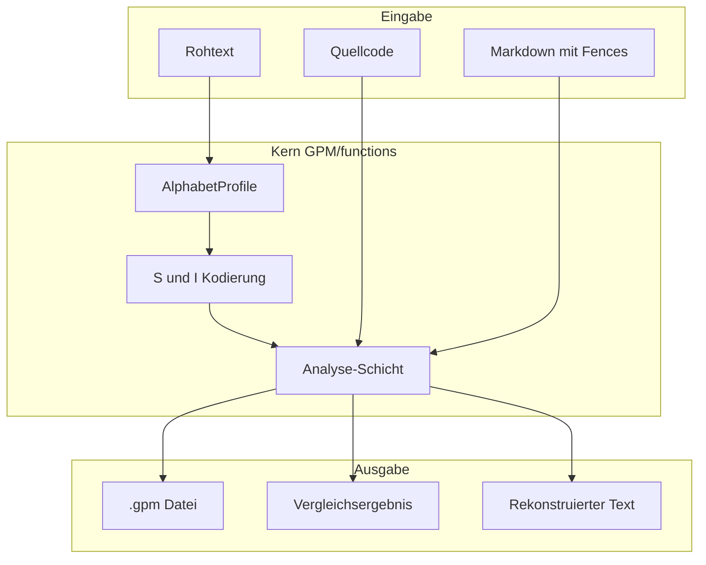
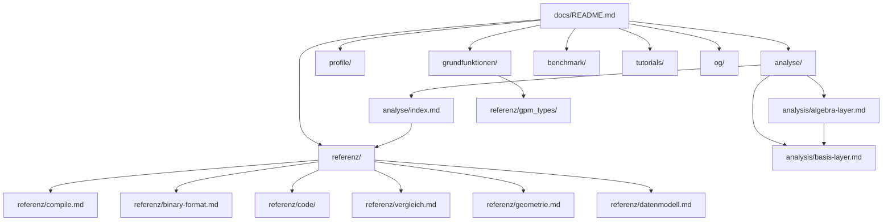

# GPM functions — Dokumentation

Willkommen in der technischen Dokumentation der **GPM Python-Bibliothek** unter `GPM/functions/`.  
Diese Bibliothek kann unabhängig von der Web-App in [`Ge-Prime-Matrix OG/`](../../Ge-Prime-Matrix%20OG/) genutzt werden.

## Was ist GPM/functions?

GPM kodiert Text als Paar **Substanz (S)** und **Permutations-Index (I)**. Die Bibliothek liefert:

- **Kodierung & Dekodierung** — Wörter und Zeichenfolgen in S/I umwandeln und zurück
- **33 Schriftprofile** — je Alphabet eigene Normalisierung, Primzahlen und Sortierreihenfolge
- **Textanalyse** — Texte kompilieren, vergleichen, als `.gpm` speichern; Quellcode in Markdown verarbeiten
- **Grenzanalyse** — wie lang und wie komplex Text pro Profil sein darf



## Themen — wohin als Nächstes?

| Thema | Dokument | Lies das, wenn du … |
|-------|----------|---------------------|
| **Grundfunktionen** | [grundfunktionen/README.md](grundfunktionen/README.md) | … verstehen willst, was S und I sind und wie Encode/Decode funktioniert |
| **Schriftprofile** | [profile/README.md](profile/README.md) | … wissen willst, welches Alphabet welche Regeln und Zeichen hat |
| **Textanalyse** | [analyse/README.md](analyse/README.md) | … Texte kompilieren, vergleichen oder Code in Markdown verarbeiten willst |
| **Algebra & Basis-Layer** | [analysis/algebra-layer.md](analysis/algebra-layer.md), [analysis/basis-layer.md](analysis/basis-layer.md) | … gestaffelten Vergleich, Korpus-Suche oder ggT/kgV-Mathematik verstehen willst |
| **Performance-Grenzen** | [benchmark/README.md](benchmark/README.md) | … wissen willst, wie lang oder komplex Text pro Profil sein darf |
| **API-Referenz** | [referenz/index.md](referenz/index.md) | … eine konkrete Funktion oder ein Modul nachschlagen willst |
| **Tutorials** | [tutorials/](tutorials/) | … Schritt für Schritt ein Beispiel durchspielen willst |
| **OG-Brücke** | [og/og-vs-gpm.md](og/og-vs-gpm.md) | … die Bibliothek mit Ge-Prime-Matrix OG vergleichen willst |

## Dokumentations-Netz



## Sitemap

| Thema | Einstieg | Referenz | Tutorial |
|-------|----------|----------|----------|
| S/I-Kern | [grundfunktionen/README.md](grundfunktionen/README.md) | [referenz/gpm_types/si.md](referenz/gpm_types/si.md), [perm.md](referenz/perm.md) | — |
| N/D/H-Typen | [grundfunktionen/README.md](grundfunktionen/README.md) | [referenz/gpm_types/ni.md](referenz/gpm_types/ni.md), [di.md](referenz/gpm_types/di.md), [hi.md](referenz/gpm_types/hi.md) | — |
| Profile | [profile/README.md](profile/README.md) | [profile/normalisierung.md](profile/normalisierung.md), [prime-blocks.md](profile/prime-blocks.md) | — |
| NL kompilieren | [analyse/README.md](analyse/README.md) | [referenz/compile.md](referenz/compile.md), [datenmodell.md](referenz/datenmodell.md) | [tutorials/erstes-gpm-dokument.md](tutorials/erstes-gpm-dokument.md) |
| Code / Hybrid | [analyse/README.md](analyse/README.md) | [referenz/code/](referenz/code/index.md) | [tutorials/code-bitgenau.md](tutorials/code-bitgenau.md), [hybrid-markdown.md](tutorials/hybrid-markdown.md) |
| Vergleich | [analyse/README.md](analyse/README.md) | [referenz/vergleich.md](referenz/vergleich.md) | [tutorials/listen-vs-silent.md](tutorials/listen-vs-silent.md) |
| Korpus / Tiered Compare | [analysis/basis-layer.md](analysis/basis-layer.md) | [analysis/algebra-layer.md](analysis/algebra-layer.md), `compare_documents_tiered` | — |
| .gpm Binary | [analyse/README.md](analyse/README.md) | [referenz/binary-format.md](referenz/binary-format.md) | [tutorials/og-v7-nach-v9.md](tutorials/og-v7-nach-v9.md) |
| Geometrie | [analyse/index.md](analyse/index.md) | [referenz/geometrie.md](referenz/geometrie.md) | — |
| OG vs GPM | [og/og-vs-gpm.md](og/og-vs-gpm.md) | [og/modul-karte.md](og/modul-karte.md), [og/roadmap.md](og/roadmap.md) | — |
| Tools & Tests | [referenz/tools.md](referenz/tools.md) | [referenz/tests.md](referenz/tests.md) | — |
| Benchmark | [benchmark/README.md](benchmark/README.md) | [benchmark/PROFILE_LIMITS.md](benchmark/PROFILE_LIMITS.md) | — |

## Für wen?

| Rolle | Start hier | Dann |
|-------|------------|------|
| **Neuling** | [grundfunktionen/README.md](grundfunktionen/README.md) → [tutorials/erstes-gpm-dokument.md](tutorials/erstes-gpm-dokument.md) | [analyse/README.md](analyse/README.md) |
| **Integrator** | [referenz/index.md](referenz/index.md) | [referenz/datenmodell.md](referenz/datenmodell.md), [binary-format.md](referenz/binary-format.md) |
| **Maintainer** | [agent.md](agent.md) | [referenz/tests.md](referenz/tests.md), [og/portiert.md](og/portiert.md) |

## Schnellbefehle

```bash
cd GPM/functions

python run_tests.py                  # alle Unit-Tests (~593, Stand Phase F)
python -m tools.perm_audit           # Perm-Invarianten aller 33 Profile
python -m tools.profile_benchmark    # Voll-Sweep über alle Profile (~54 s)
```

## Benchmark-Artefakte (generiert)

Nach `python -m tools.profile_benchmark`:

- [benchmark/PROFILE_LIMITS.md](benchmark/PROFILE_LIMITS.md) — Tabellen-Report (auto-generiert)
- [benchmark/benchmark_results.json](benchmark/benchmark_results.json) — JSON-Rohdaten

## Für Entwickler am Repo

Kompakte Ordner-Karte und CI-Hinweise: [agent.md](agent.md) — **nicht** der Einstieg für neue Leser; starte mit den READMEs oben.
