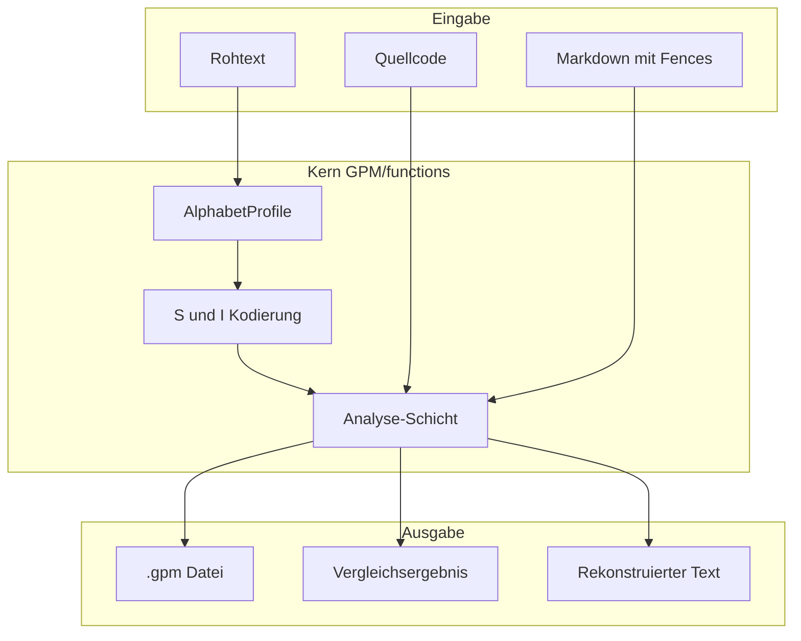

# GPM functions — Dokumentation

Willkommen in der technischen Dokumentation der **GPM Python-Bibliothek** unter `GPM/functions/`.  
Diese Bibliothek kann unabhängig von der Web-App in [`Ge-Prime-Matrix OG/`](../../Ge-Prime-Matrix%20OG/) genutzt werden.

## Was ist GPM/functions?

GPM kodiert Text als Paar **Substanz (S)** und **Permutations-Index (I)**. Die Bibliothek liefert:

- **Kodierung & Dekodierung** — Wörter und Zeichenfolgen in S/I umwandeln und zurück
- **33 Schriftprofile** — je Alphabet eigene Normalisierung, Primzahlen und Sortierreihenfolge
- **Textanalyse** — Texte kompilieren, vergleichen, als `.gpm` speichern; Quellcode in Markdown verarbeiten
- **Grenzanalyse** — wie lang und wie komplex Text pro Profil sein darf



## Themen — wohin als Nächstes?

| Thema | Dokument | Lies das, wenn du … |
|-------|----------|---------------------|
| **Grundfunktionen** | [grundfunktionen/README.md](grundfunktionen/README.md) | … verstehen willst, was S und I sind und wie Encode/Decode funktioniert |
| **Schriftprofile** | [profile/README.md](profile/README.md) | … wissen willst, welches Alphabet welche Regeln und Zeichen hat |
| **Textanalyse** | [analyse/README.md](analyse/README.md) | … Texte kompilieren, vergleichen oder Code in Markdown verarbeiten willst |
| **Performance-Grenzen** | [benchmark/README.md](benchmark/README.md) | … wissen willst, wie lang oder komplex Text pro Profil sein darf |

## Schnellbefehle

```bash
cd GPM/functions

python run_tests.py                  # alle Unit-Tests
python -m tools.perm_audit           # Perm-Invarianten aller 33 Profile
python -m tools.profile_benchmark    # Voll-Sweep über alle Profile (~54 s)
```

## Benchmark-Artefakte (generiert)

Nach `python -m tools.profile_benchmark`:

- [benchmark/PROFILE_LIMITS.md](benchmark/PROFILE_LIMITS.md) — Tabellen-Report (auto-generiert)
- [benchmark/benchmark_results.json](benchmark/benchmark_results.json) — JSON-Rohdaten

## Für Entwickler am Repo

Kompakte Ordner-Karte und CI-Hinweise: [agent.md](agent.md) — **nicht** der Einstieg für neue Leser; starte mit den READMEs oben.
