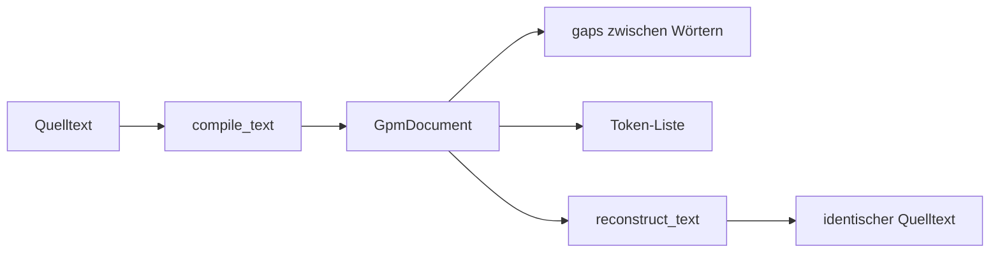
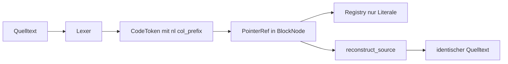
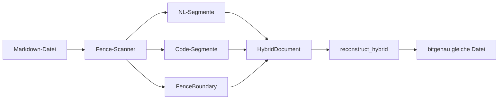

# Textanalyse

Die Analyse-Schicht in `GPM/functions/analysis/` verarbeitet **Natürlichsprache**, **Quellcode** und **Markdown mit Code-Fences**. Sie kompiliert Text in strukturierte Dokumente, vergleicht sie ohne rohen String-Vergleich und schreibt `.gpm`-Dateien.

**Kernregel:** Ähnlichkeit wird über **Substanz (S), Index (I), ggT, kgV und DTW auf Substanz-Ketten** gemessen — nicht über `text1 == text2`.

## Deep Dive — Detaildokumentation

| Thema | Detailseite |
|-------|-------------|
| Navigation & Paket-Karte | [index.md](index.md) |
| Datenmodell | [../referenz/datenmodell.md](../referenz/datenmodell.md) |
| NL kompilieren | [../referenz/compile.md](../referenz/compile.md) |
| `.gpm`-Format | [../referenz/binary-format.md](../referenz/binary-format.md) |
| Geometrie & Hierarchie | [../referenz/geometrie.md](../referenz/geometrie.md) |
| Vergleich & Kurven | [../referenz/vergleich.md](../referenz/vergleich.md) |
| Algebra-Layer (Schicht 0) | [../analysis/algebra-layer.md](../analysis/algebra-layer.md) |
| Basis-Layer (Tiered Compare) | [../analysis/basis-layer.md](../analysis/basis-layer.md) |
| Code & Hybrid | [../referenz/code/index.md](../referenz/code/index.md) |
| Vollständige API | [../referenz/index.md](../referenz/index.md) |

## Begriffe kurz erklärt

| Begriff | Was es ist |
|---------|------------|
| **GpmDocument** | Kompiliertes NL-Dokument: Wort-Liste, Lücken (`gaps`) dazwischen, Wörterbuch (`header`) |
| **Registry** | Gemeinsames Wörterbuch für Literale (Wörter, Zahlen, Code-Symbole) — jeder Eintrag einmal |
| **BlockNode** | Baumknoten für Code-Struktur (Module, Blöcke, Anweisungen) |
| **HybridDocument** | Markdown aufgeteilt in NL- und Code-Segmente plus Fence-Grenzen |

---

## Natürlicher Text (NL)

Prosa wird Wort für Wort tokenisiert. **Leerzeichen, Zeilenumbrüche und Satzzeichen** liegen in `gaps[]` **zwischen** den Wörtern — nie als eigenständige „Wörter“ in der Registry.



**Gap-Symmetrie:** Wenn du `n` Wörter hast, gibt es `n + 1` Gaps (davor, dazwischen, danach). Rekonstruktion: `gap[0] + wort[0] + gap[1] + wort[1] + … + gap[n]`.

```python
from alphabets import AlphabetProfile
from analysis.compile.compiler import compile_text
from analysis.compile.reconstruct import reconstruct_text

text = "Hello, world!"
doc, _ = compile_text(text, AlphabetProfile.OG)
assert reconstruct_text(doc) == text
```

---

## Quellcode (Python, JavaScript, HTML)

Quellcode wird tokenisiert mit **Formatierungs-Metadaten**, damit der Text **bitgenau** zurückgewonnen werden kann:

| Feld | Bedeutung | Beispiel |
|------|-----------|----------|
| `nl` | Anzahl `\n` unmittelbar vor diesem Token | `1` = neue Zeile davor |
| `col_prefix` | Leerzeichen/Tabs auf der Zeile nach den Newlines | `"    "` = 4 Spaces Einrückung |
| `trailing_whitespace` | Rest am Dateiende nach dem letzten Token | `"\n"` |



```python
from analysis.blocks.registry import DocumentRegistry
from analysis.code.compile import compile_source, verify_reversibility
from analysis.code.decompile import reconstruct_source
from alphabets import AlphabetProfile

reg = DocumentRegistry(profile=AlphabetProfile.OG)
src = "def foo():\n    return 1\n"
mod = compile_source(src, "py", reg)
assert reconstruct_source(mod, reg) == src
assert verify_reversibility(src, "py", reg)
```

### Unterstützte Sprachen

| Sprache | Block-Stil | Kommentare | Dateien |
|---------|------------|------------|---------|
| Python | Einrückung | `#` | `.py`, `.pyw`, `.pyi` |
| JavaScript/TS | Klammern | `//`, `/* */` | `.js`, `.ts`, `.jsx`, `.tsx`, `.mjs`, `.cjs` |
| HTML / XML | Tags | `<!-- -->` (HTML) | `.html`, `.htm`, `.xhtml`, `.xml` |
| C, Java, Go, Rust, PHP, C#, Swift, Kotlin, CSS | Klammern | `//`, `/* */` | `.c`, `.java`, `.go`, `.rs`, … |
| Ruby, Shell, SQL | Keywords | `#` / `#` / `--` + `/* */` | `.rb`, `.sh`, `.sql` |
| JSON, TOML, Markdown | flat (keine `{`-Blöcke) | je nach Spec | `.json`, `.toml`, `.md` |

Keywords und Sprachregeln: `analysis/code/languages.py`. Fence-Aliases (`javascript` → `js`, `python3` → `py`) in derselben Datei.

### Tokenizer-Guards (bitgenaue Code-Pipeline)

| Guard | Regel |
|-------|--------|
| **A — Case** | SQL/Ruby/Shell: Keyword-Erkennung intern case-insensitive (`keywords_lower`); **Quelltext-Slice unverändert** in Token und Registry |
| **B — Blockkommentare** | `/* … */` (mehrzeilig): ein C-Token; inneres `\n` zählt **nicht** als `nl` des folgenden Tokens — Gap nur **nach** `*/` |

Tests: `tests/analysis/test_code_tokenizer_guards.py`.

### Toy vs GPM

| | **Toy v35** | **GPM/functions** |
|---|-------------|-------------------|
| Ziel | Normalisierte Redundanz-Analyse (Uppercase, Kommentare weg) | Bitgenaue Rekonstruktion + Analyse |
| Kanonisierung | Default | **Optional** — `canonicalize_for_analysis()` in `analysis/code/canonicalize.py` |
| Block-Stile | indent, brace, tag, keyword, flat | gleiche Stile; Toy-Uppercase **nicht** im Default-Compile |

### Kommentare

Kommentare sind **strukturelle Symbole (C)**, nicht Wort-Substanz (S). Sie werden mit exaktem Text gespeichert und tragen `nl`/`col_prefix` wie alle Code-Token.

### HTML: Tag in zwei Schritten

1. **Open-Marker** — nur für Verschachtelung, kein sichtbarer Output
2. **C-Token** — voller Tag-Text inkl. Attribute, z. B. `<div class="a">`

Kommentare `<!-- ... -->` sind ein einzelnes C-Token.

---

## Hybrid: Prosa + Code in Markdown

Markdown-Dateien mit `` ```py `` oder `~~~`-Fences werden in Segmente zerlegt. **Wichtig:** Leerzeilen und Spaces **um** die Fence-Zeilen gehören **nicht** in NL-Gaps oder Code-Einrückung — sie sitzen an expliziten **Fence-Grenzen**.



**Gap-Erhaltungs-Invariante:** Wenn du `"Title\n\n```py\nif True: pass\n```\n"` kompilierst und rekonstruierst, muss **jede** Newline und jeder Space an der gleichen Stelle bleiben — auch die Leerzeile vor `` ``` `` und ein Space nach der schließenden Fence.

```python
from analysis.code.compile import compile_hybrid, verify_hybrid_reversibility
from analysis.code.decompile import reconstruct_hybrid
from alphabets import AlphabetProfile

src = "Title\n\n```py\nif True: pass\n```\n"
doc = compile_hybrid(src, AlphabetProfile.OG)
assert reconstruct_hybrid(doc) == src
assert verify_hybrid_reversibility(src)
```

In Prosa ist `If` ein **Wort (S)**; im Code-Fence ist `if` ein **Keyword (C)** — getrennte Parse-Kontexte verhindern Interferenz.

---

## Dokumente vergleichen

`analyze_pair` misst Ähnlichkeit über **vier unabhängige Achsen**:

| Achse | Was sie misst | LISTEN vs SILENT |
|-------|---------------|------------------|
| **substance** | Gemeinsame Buchstaben-Substanz | ≈ 1.0 (Anagramme) |
| **token_i** | I-Ratio + Phasenabweichung | < 1.0 |
| **cell_i** | Satz-Geometrie | variabel |
| **hierarchy** | Satz-/Absatz-Struktur | optional |

```python
from analysis.curves.compare import analyze_pair
from analysis.compile.compiler import compile_text
from alphabets import AlphabetProfile

d1, _ = compile_text("LISTEN", AlphabetProfile.OG)
d2, _ = compile_text("SILENT", AlphabetProfile.OG)
result = analyze_pair(d1, d2)
# result["substance_parallel"] == True  — gleiche Buchstaben
# token_i-Achse trotzdem < 1.0       — andere Reihenfolge
```

---

## Gestaffelter Vergleich & Korpus

Für große Korpora oder schnelle Vorfilterung ohne O(n²)-Voll-DTW: **Basis-Layer** (Tier 0–4).

| Tier | Name | Inhalt |
|------|------|--------|
| 0 | GATE | Profil-Symmetrie, Prim-Disjunktion |
| 1 | BASIS | Log-Profil ggT/kgV, Jaccard, Relations-Sketch |
| 2 | STRUCTURE | Meta-Genom, Relations-Profil |
| 3 | CURVES | substance_align, i_curve |
| 4 | FULL | `analyze_pair_full` (Voll-DTW) |

Default für Korpus-Suche: `max_tier=CompareTier.BASIS`. Mathematik und Gewichte: [algebra-layer.md](../analysis/algebra-layer.md). API-Details: [basis-layer.md](../analysis/basis-layer.md).

```python
from analysis.basis import (
    build_basis_index,
    compare_documents_tiered,
    find_similar_documents,
    CompareTier,
)
from analysis.compile.compiler import compile_text
from alphabets import AlphabetProfile

docs = [compile_text(t, AlphabetProfile.OG)[0] for t in ("Hello world", "World hello")]
index = build_basis_index(docs, profile=AlphabetProfile.OG)
results = find_similar_documents(docs[0], index, top_k=5, max_tier=CompareTier.BASIS)
```

`analyze_pair` akzeptiert optional `basis_prefilter=True` (Tier-1-Gate) oder eine vorberechnete Basis-Signatur — siehe [basis-layer.md](../analysis/basis-layer.md).

---

## .gpm-Dateien

Das Binärformat speichert kompilierte Dokumente. Varianten nach **Zweck**:

| Variante | Zweck |
|----------|-------|
| **Flach** | Wortliste + Gaps — kompatibel mit älteren Lesern |
| **Mit Profil** | AlphabetProfile + erweiterte Separator/GAP-Kodierung |
| **Mit Hierarchie** | Fraktale Satz-/Absatz-Struktur + GAP-RLE |
| **v9 + Block-Tree** | Code-`BlockNode` optional eingebettet (`FLAG_BLOCK_TREE`) |

**OG-Kompatibilität:** v4/v8/v9 nativ via `read_gpm`; v7 best-effort via `analysis/binary/compat.read_gpm_any`. OG-Web-Features (Meta-Genom, Spectroscope) bleiben in Ge-Prime-Matrix OG — Bibliothek portiert selektiv Page-Spans und `substance_align`.

**Hybrid-Export:** `compile_hybrid_to_gpm()` schreibt NL-Body + Code-Registry/Block-Tree als v9.

Module: `analysis/binary/format.py`, `compat.py`.

---

## Modul-Karte

```
analysis/
  algebra/        Schicht 0 — Gates, substance_kernel, fusion, window_fold
  basis/          Signaturen, Index, Tiered Compare, Korpus-API
  blocks/         Registry, BlockNode, PointerRef, Codec
  cell/           Zell-Geometrie
  hierarchy/      Sätze, Absätze
  curves/         I-Kurve, analyze_pair (DTW-Fusion)
  meta/           Meta-Genom, Relations-Profil
  search/         Spectroscope, hierarchy_search
  corpus/         Anagramm-Korpus-Protokoll (Stub)
  code/           Tokenizer, Compile, Decompile, Hybrid
  compile/        compile_text, reconstruct_text
  binary/         .gpm lesen/schreiben
  pair/           Wortpaar-Analyse
```

---

## API-Kurzreferenz

Vollständiger Index mit Signaturen: [../referenz/index.md](../referenz/index.md).

| Funktion | Beschreibung | Detail |
|----------|--------------|--------|
| `compile_text` | NL-Text → `GpmDocument` | [compile.md](../referenz/compile.md) |
| `reconstruct_text` | `GpmDocument` → Quelltext (1:1) | [compile.md](../referenz/compile.md) |
| `compile_text_to_gpm` | NL → `.gpm`-Bytes | [compile.md](../referenz/compile.md) |
| `write_gpm` / `read_gpm` | Binär I/O | [binary-format.md](../referenz/binary-format.md) |
| `compile_source` | Code → `BlockNode` | [code/index.md](../referenz/code/index.md) |
| `reconstruct_source` | `BlockNode` → Quelltext (1:1) | [code/index.md](../referenz/code/index.md) |
| `verify_reversibility` | Code-Round-Trip-Check | [code/tokenizer.md](../referenz/code/tokenizer.md) |
| `compile_hybrid` | Markdown + Fences → `HybridDocument` | [code/compile-hybrid.md](../referenz/code/compile-hybrid.md) |
| `compile_hybrid_to_gpm` | Hybrid → v9-`.gpm`-Bytes | [code/compile-hybrid.md](../referenz/code/compile-hybrid.md) |
| `reconstruct_hybrid` | `HybridDocument` → Markdown (1:1) | [code/compile-hybrid.md](../referenz/code/compile-hybrid.md) |
| `verify_hybrid_reversibility` | Hybrid-Round-Trip-Check | [code/compile-hybrid.md](../referenz/code/compile-hybrid.md) |
| `canonicalize_for_analysis` | Optional Toy-ähnliche Normalisierung | [code/compile-hybrid.md](../referenz/code/compile-hybrid.md) |
| `read_gpm_any` | v4/v7/v8/v9 lesen | [binary-format.md](../referenz/binary-format.md) |
| `analyze_pair` | Zwei Dokumente vergleichen (DTW-Fusion) | [vergleich.md](../referenz/vergleich.md) |
| `compare_documents_tiered` | Gestaffelter Paar-Vergleich (Tier 0–4) | [basis-layer.md](../analysis/basis-layer.md) |
| `find_similar_documents` | Korpus-Suche mit Basis-Index | [basis-layer.md](../analysis/basis-layer.md) |
| `build_basis_index` | Invertierter Basis-Index für Korpus | [basis-layer.md](../analysis/basis-layer.md) |
| `query_candidates` | Kandidaten-Vorfilter (Postings + MinHash) | [basis-layer.md](../analysis/basis-layer.md) |
| `analyze_word_pair` | Ein Wortpaar analysieren | [vergleich.md](../referenz/vergleich.md) |
| `materialize_geometry` | Zellen + Hierarchie + Blockbaum | [geometrie.md](../referenz/geometrie.md) |
| `compile_source_file` | Datei per Endung → Code-Modul | [code/index.md](../referenz/code/index.md) |

---

## Grenzen

| Thema | Status |
|-------|--------|
| JSX in JavaScript | nicht unterstützt |
| Python `\` Zeilenfortsetzung | nicht unterstützt |
| CRLF (`\r\n`) | wird vor dem Lexer zu `\n` normalisiert |
| Binärdateien (`.min.js`, …) | `IGNORED_SUFFIXES` — kein Auto-Compile |

---

## Tests

```bash
cd GPM/functions
python run_tests.py
```

Relevante Testmodule: `test_code_tokenizer_guards`, `test_code_languages`, `test_tokenize_keyword`, `test_fence_aliases`, `test_v9_hybrid`, `test_code_hybrid_gaps`, `test_code_interference`, `test_curves_fusion`.

**Algebra / Basis (Phase D–F):** `test_substance_kernel_imports`, `test_exponent_window_lcm`, `test_log_jaccard_blend`, `test_weight_literal_audit`, `test_tier_fusion_blends`, `test_fingerprint_log_invariant`, `test_i_ratio_invariant`, `test_typed_sketch_weight`, `test_compare_tiered`, `test_corpus_compare`, `test_basis_corpus_smoke` — vollständige Matrix: [referenz/tests.md](../referenz/tests.md).

## Siehe auch

- [Algebra-Layer](../analysis/algebra-layer.md) — Schicht 0, Invarianten D–F
- [Basis-Layer](../analysis/basis-layer.md) — Tiered Compare, Korpus
- [Analyse-Navigation](index.md) — Deep Dives nach Paket
- [Grundfunktionen](../grundfunktionen/README.md) — S/I-Kodierung
- [Profile](../profile/README.md) — Schriftprofile
- [Referenz-Index](../referenz/index.md) — alle APIs
- [Doku-Hub](../README.md) — Gesamtübersicht
