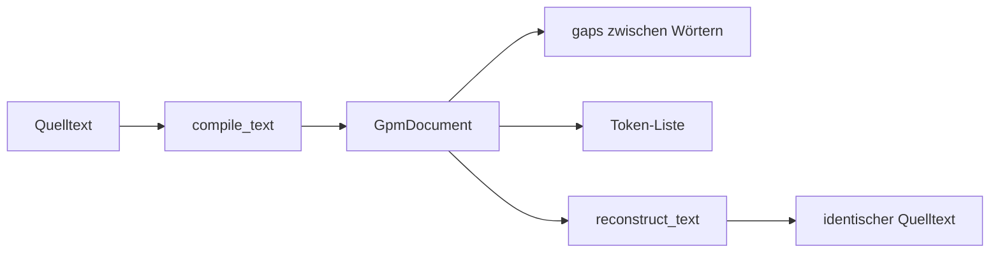
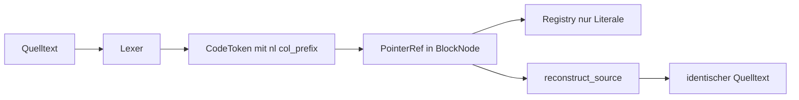
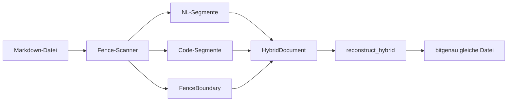

# Textanalyse

Die Analyse-Schicht in `GPM/functions/analysis/` verarbeitet **Natürlichsprache**, **Quellcode** und **Markdown mit Code-Fences**. Sie kompiliert Text in strukturierte Dokumente, vergleicht sie ohne rohen String-Vergleich und schreibt `.gpm`-Dateien.

**Kernregel:** Ähnlichkeit wird über **Substanz (S), Index (I), ggT, kgV und DTW auf Substanz-Ketten** gemessen — nicht über `text1 == text2`.

## Begriffe kurz erklärt

| Begriff | Was es ist |
|---------|------------|
| **GpmDocument** | Kompiliertes NL-Dokument: Wort-Liste, Lücken (`gaps`) dazwischen, Wörterbuch (`header`) |
| **Registry** | Gemeinsames Wörterbuch für Literale (Wörter, Zahlen, Code-Symbole) — jeder Eintrag einmal |
| **BlockNode** | Baumknoten für Code-Struktur (Module, Blöcke, Anweisungen) |
| **HybridDocument** | Markdown aufgeteilt in NL- und Code-Segmente plus Fence-Grenzen |

---

## Natürlicher Text (NL)

Prosa wird Wort für Wort tokenisiert. **Leerzeichen, Zeilenumbrüche und Satzzeichen** liegen in `gaps[]` **zwischen** den Wörtern — nie als eigenständige „Wörter“ in der Registry.



**Gap-Symmetrie:** Wenn du `n` Wörter hast, gibt es `n + 1` Gaps (davor, dazwischen, danach). Rekonstruktion: `gap[0] + wort[0] + gap[1] + wort[1] + … + gap[n]`.

```python
from alphabets import AlphabetProfile
from analysis.compile.compiler import compile_text
from analysis.compile.reconstruct import reconstruct_text

text = "Hello, world!"
doc, _ = compile_text(text, AlphabetProfile.OG)
assert reconstruct_text(doc) == text
```

---

## Quellcode (Python, JavaScript, HTML)

Quellcode wird tokenisiert mit **Formatierungs-Metadaten**, damit der Text **bitgenau** zurückgewonnen werden kann:

| Feld | Bedeutung | Beispiel |
|------|-----------|----------|
| `nl` | Anzahl `\n` unmittelbar vor diesem Token | `1` = neue Zeile davor |
| `col_prefix` | Leerzeichen/Tabs auf der Zeile nach den Newlines | `"    "` = 4 Spaces Einrückung |
| `trailing_whitespace` | Rest am Dateiende nach dem letzten Token | `"\n"` |



```python
from analysis.blocks.registry import DocumentRegistry
from analysis.code.compile import compile_source, verify_reversibility
from analysis.code.decompile import reconstruct_source
from alphabets import AlphabetProfile

reg = DocumentRegistry(profile=AlphabetProfile.OG)
src = "def foo():\n    return 1\n"
mod = compile_source(src, "py", reg)
assert reconstruct_source(mod, reg) == src
assert verify_reversibility(src, "py", reg)
```

### Unterstützte Sprachen

| Sprache | Block-Stil | Kommentare | Dateien |
|---------|------------|------------|---------|
| Python | Einrückung | `#` bis Zeilenende | `.py`, `.pyw` |
| JavaScript/TS | geschweifte Klammern | `//`, `/* */` | `.js`, `.ts`, `.jsx`, `.tsx` |
| HTML | Tags | `<!-- -->` | `.html`, `.htm` |

Keywords und Sprachregeln: `analysis/code/languages.py`.

### Kommentare

Kommentare sind **strukturelle Symbole (C)**, nicht Wort-Substanz (S). Sie werden mit exaktem Text gespeichert und tragen `nl`/`col_prefix` wie alle Code-Token.

### HTML: Tag in zwei Schritten

1. **Open-Marker** — nur für Verschachtelung, kein sichtbarer Output
2. **C-Token** — voller Tag-Text inkl. Attribute, z. B. `<div class="a">`

Kommentare `<!-- ... -->` sind ein einzelnes C-Token.

---

## Hybrid: Prosa + Code in Markdown

Markdown-Dateien mit `` ```py `` oder `~~~`-Fences werden in Segmente zerlegt. **Wichtig:** Leerzeilen und Spaces **um** die Fence-Zeilen gehören **nicht** in NL-Gaps oder Code-Einrückung — sie sitzen an expliziten **Fence-Grenzen**.



**Gap-Erhaltungs-Invariante:** Wenn du `"Title\n\n```py\nif True: pass\n```\n"` kompilierst und rekonstruierst, muss **jede** Newline und jeder Space an der gleichen Stelle bleiben — auch die Leerzeile vor `` ``` `` und ein Space nach der schließenden Fence.

```python
from analysis.code.compile import compile_hybrid, verify_hybrid_reversibility
from analysis.code.decompile import reconstruct_hybrid
from alphabets import AlphabetProfile

src = "Title\n\n```py\nif True: pass\n```\n"
doc = compile_hybrid(src, AlphabetProfile.OG)
assert reconstruct_hybrid(doc) == src
assert verify_hybrid_reversibility(src)
```

In Prosa ist `If` ein **Wort (S)**; im Code-Fence ist `if` ein **Keyword (C)** — getrennte Parse-Kontexte verhindern Interferenz.

---

## Dokumente vergleichen

`analyze_pair` misst Ähnlichkeit über **vier unabhängige Achsen**:

| Achse | Was sie misst | LISTEN vs SILENT |
|-------|---------------|------------------|
| **substance** | Gemeinsame Buchstaben-Substanz | ≈ 1.0 (Anagramme) |
| **token_i** | I-Ratio + Phasenabweichung | < 1.0 |
| **cell_i** | Satz-Geometrie | variabel |
| **hierarchy** | Satz-/Absatz-Struktur | optional |

```python
from analysis.curves.compare import analyze_pair
from analysis.compile.compiler import compile_text
from alphabets import AlphabetProfile

d1, _ = compile_text("LISTEN", AlphabetProfile.OG)
d2, _ = compile_text("SILENT", AlphabetProfile.OG)
result = analyze_pair(d1, d2)
# result["substance_parallel"] == True  — gleiche Buchstaben
# token_i-Achse trotzdem < 1.0       — andere Reihenfolge
```

---

## .gpm-Dateien

Das Binärformat speichert kompilierte Dokumente. Varianten nach **Zweck**:

| Variante | Zweck |
|----------|-------|
| **Flach** | Wortliste + Gaps — kompatibel mit älteren Lesern |
| **Mit Profil** | AlphabetProfile + erweiterte Separator/GAP-Kodierung |
| **Mit Hierarchie** | Fraktale Satz-/Absatz-Struktur + GAP-RLE |

**GAP-RLE:** Abweichungen von der Standard-Hierarchie (z. B. spezielle `\n`-Abstände) werden als kompakte Deltas gespeichert — verlustfrei relativ zur rekonstruierbaren Basis-Hierarchie.

Module: `analysis/binary/write_gpm.py`, `read_gpm.py`, `format.py`.

---

## Modul-Karte

```
analysis/
  blocks/         Registry, BlockNode, PointerRef, Codec
  cell/           Zell-Geometrie
  hierarchy/      Sätze, Absätze
  curves/         I-Kurve, analyze_pair (DTW-Fusion)
  code/           Tokenizer, Compile, Decompile, Hybrid
  compile/        compile_text, reconstruct_text
  binary/         .gpm lesen/schreiben
  pair/           Wortpaar-Analyse
```

---

## API-Kurzreferenz

| Funktion | Beschreibung |
|----------|--------------|
| `compile_text` | NL-Text → `GpmDocument` |
| `reconstruct_text` | `GpmDocument` → Quelltext (1:1) |
| `compile_source` | Code → `BlockNode` |
| `reconstruct_source` | `BlockNode` → Quelltext (1:1) |
| `verify_reversibility` | Code-Round-Trip-Check |
| `compile_hybrid` | Markdown + Fences → `HybridDocument` |
| `reconstruct_hybrid` | `HybridDocument` → Markdown (1:1) |
| `verify_hybrid_reversibility` | Hybrid-Round-Trip-Check |
| `analyze_pair` | Zwei Dokumente vergleichen (DTW-Fusion) |
| `compile_source_file` | Datei per Endung → Code-Modul |

---

## Grenzen

| Thema | Status |
|-------|--------|
| JSX in JavaScript | nicht unterstützt |
| Python `\` Zeilenfortsetzung | nicht unterstützt |
| Ruby, SQL, Shell (Keyword-Sprachen) | nicht implementiert |
| CRLF (`\r\n`) | wird vor dem Lexer zu `\n` normalisiert |

---

## Tests

```bash
cd GPM/functions
python run_tests.py
```

Relevante Testmodule: `test_code_nl_invariant`, `test_code_languages`, `test_code_hybrid_gaps`, `test_code_interference`, `test_curves_fusion`.

## Siehe auch

- [Grundfunktionen](../grundfunktionen/README.md) — S/I-Kodierung
- [Profile](../profile/README.md) — Schriftprofile
- [Doku-Hub](../README.md) — Gesamtübersicht
