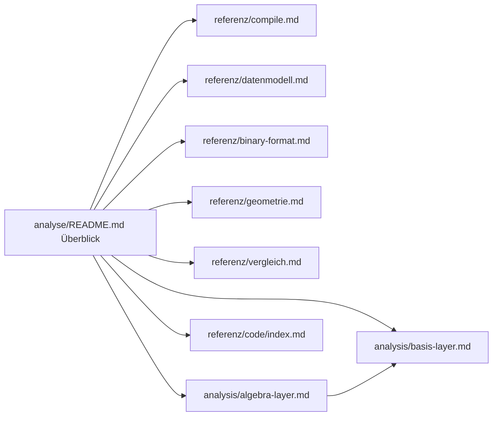

# Analyse — Navigation

Übersicht aller Analyse-Dokumente. Der **Einstieg für Konzepte** bleibt [README.md](README.md); hier findest du **Deep Dives** nach Thema.

## Nach Aufgabe

| Ich will … | Seite |
|------------|-------|
| Prosa kompilieren und rekonstruieren | [referenz/compile.md](../referenz/compile.md) |
| Datenstrukturen verstehen | [referenz/datenmodell.md](../referenz/datenmodell.md) |
| `.gpm` lesen/schreiben | [referenz/binary-format.md](../referenz/binary-format.md) |
| Satz-/Absatz-Geometrie | [referenz/geometrie.md](../referenz/geometrie.md) |
| Zwei Texte vergleichen | [referenz/vergleich.md](../referenz/vergleich.md) |
| Korpus durchsuchen | [analysis/basis-layer.md](../analysis/basis-layer.md) |
| Tiered Compare ohne Voll-DTW | [analysis/basis-layer.md](../analysis/basis-layer.md), [analysis/algebra-layer.md](../analysis/algebra-layer.md) |
| Quellcode bitgenau verarbeiten | [referenz/code/index.md](../referenz/code/index.md) |
| Case / Explicit in `.gpm` | [referenz/case-policy.md](../referenz/case-policy.md) |
| Fenster-Suche im Dokument | [referenz/index-package.md](../referenz/index-package.md) |

## Nach Paket (`analysis/`)

| Paket | Referenz | Kurz |
|-------|----------|------|
| `compile/` | [compile.md](../referenz/compile.md) | NL-Tokenisierung, `compile_text` |
| `document/` | [datenmodell.md](../referenz/datenmodell.md) | `GpmDocument`, Invarianten |
| `binary/` | [binary-format.md](../referenz/binary-format.md) | v4/v8/v9, Flags, I/O |
| `code/` | [code/index.md](../referenz/code/index.md) | Tokenizer, Hybrid, Sprachen |
| `blocks/` | [datenmodell.md](../referenz/datenmodell.md), [geometrie.md](../referenz/geometrie.md) | Registry, BlockNode, Codec |
| `hierarchy/` | [geometrie.md](../referenz/geometrie.md) | Sätze, Absätze, Seiten |
| `cell/` | [geometrie.md](../referenz/geometrie.md) | Zell-Geometrie, Perm-Overflow |
| `curves/` | [vergleich.md](../referenz/vergleich.md) | Kurven, `analyze_pair` |
| `substance/` | [vergleich.md](../referenz/vergleich.md) | ggT/kgV, Diff |
| `align/` | [vergleich.md](../referenz/vergleich.md) | Substanz-DTW |
| `pair/` | [vergleich.md](../referenz/vergleich.md) | Wortpaar-Analyse |
| `case/` | [case-policy.md](../referenz/case-policy.md) | Groß/Klein-Speicherung |
| `index/` | [index-package.md](../referenz/index-package.md) | Substance-/Interval-Index |
| `geom/` | [vergleich.md](../referenz/vergleich.md) | DTW-Kern |
| `algebra/` | [analysis/algebra-layer.md](../analysis/algebra-layer.md) | Schicht 0 — Gates, Kernel, Fusion, MinHash |
| `basis/` | [analysis/basis-layer.md](../analysis/basis-layer.md) | Signaturen, Index, Tiered Compare, Korpus |
| `meta/` | [vergleich.md](../referenz/vergleich.md) | Meta-Genom, Relations-Profil |
| `search/` | [index-package.md](../referenz/index-package.md) | Spectroscope, hierarchy_search |
| `corpus/` | [analysis/basis-layer.md](../analysis/basis-layer.md) | Anagramm-Korpus-Protokoll |
| `reconstruct/` | [geometrie.md](../referenz/geometrie.md) | Gap-Ableitung |

## Tutorials

| Tutorial | Link |
|----------|------|
| Erstes `.gpm`-Dokument | [../tutorials/erstes-gpm-dokument.md](../tutorials/erstes-gpm-dokument.md) |
| LISTEN vs SILENT | [../tutorials/listen-vs-silent.md](../tutorials/listen-vs-silent.md) |
| Code bitgenau | [../tutorials/code-bitgenau.md](../tutorials/code-bitgenau.md) |
| Hybrid-Markdown | [../tutorials/hybrid-markdown.md](../tutorials/hybrid-markdown.md) |
| OG v7 lesen | [../tutorials/og-v7-nach-v9.md](../tutorials/og-v7-nach-v9.md) |

## OG-Bezug

Was in der Web-App noch liegt und was in der Bibliothek ist: [../og/og-vs-gpm.md](../og/og-vs-gpm.md).

## Siehe auch

- [Analyse-Überblick](README.md)
- [API-Index](../referenz/index.md)
- [Doku-Hub](../README.md)
