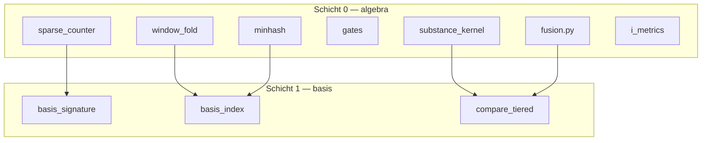

# Algebra-Layer — Schicht 0

Reine Mathematik, Gates und Score-Fusion unter `GPM/functions/analysis/algebra/`.  
Kein Dokument-I/O, keine `.gpm`-Serialisierung — das übernimmt Schicht 1 ([Basis-Layer](basis-layer.md)) und darüberliegende Pakete (`curves/`, `binary/`, …).



## Rolle

| Schicht | Paket | Verantwortung |
|---------|-------|---------------|
| **0** | `analysis/algebra/` | ggT/kgV, Log-Profil, MinHash, Fenster-Fold, Gewichts-Fusion, Guards |
| **1** | `analysis/basis/` | Signaturen, invertierter Index, Tiered Compare, Korpus-API |
| **2+** | `curves/`, `meta/`, `align/` | Voll-DTW, Meta-Genom, Dokument-Kurven |

Import-Regel für Anwendungscode: bevorzugt `from analysis.algebra import …` oder das spezifische Untermodul — nicht die Legacy-Hülle `analysis/substance/`.

---

## Module

| Modul | Datei | Kurz |
|-------|-------|------|
| **substance_kernel** | `substance_kernel.py` | Kanonischer ggT/kgV-Dispatcher — alle Produktionspfade |
| **fusion** | `fusion.py` | Einzige Quelle der Gewichts-Literale (`WEIGHTS_*`, Blend-Funktionen) |
| **window_fold** | `window_fold.py` | Fenster über Exponenten; `exponent_window_to_substance` (F-A) |
| **gates** | `gates.py` | `profile_symmetry_guard`, Prim-Disjunktion, Relevanz-Gates |
| **log_profile** | `log_profile.py` | O(k) Log-Summe, `profile_log_norm`, `log_jaccard_primes` |
| **sparse_counter** | `sparse_counter.py` | O(k) Cosine/Jaccard auf Prim-Exponenten (D-A) |
| **minhash** | `minhash.py` | `prime_minhash`, `minhash_band_distance` (Härtungs-Inv. A) |
| **i_metrics** | `i_metrics.py` | `i_ratio_similarity`, `i_ratio_distance` (E-B) |
| **typed_bridge** | `typed_bridge.py` | N(I)/D(I)-Sketches, `typed_sketch_jaccard` (E-C) |
| **fold** | `fold.py` | `fold_gcd`, `fold_lcm`, `fold_lcm_span`, `passes_kgv_gate` |
| **multiset** | `multiset.py` | `anagram_class_key`, `perm_compatible` |
| **offset** | `offset.py` | Strukturelle Offset-Klassifikation, Twin-Buckets |
| **tier_fusion** | `tier_fusion.py` | `fuse_tier_scores` — Tier-übergreifende Aggregation |

---

## Import-Regel F-1

**Produktionscode** importiert Substanz-Vergleich über den Kernel — nicht direkt aus `analysis/substance/`:

```python
# Kanonisch (Phase F)
from analysis.algebra.substance_kernel import (
    compare_substances,
    substance_ggt_kgv_similarity,
    substance_ggt_kgv_distance,
    substance_transition_fields,
    empty_transition_fields,
    substance_covers,
)

# Legacy — Re-Export, weiterhin für Tests/Parität gültig
from analysis.substance.compare import compare_substances  # → substance_kernel
```

Betroffene Produktionsmodule (Auszug): `binary/search.py`, `pair/analyze_word_pair.py`, `algebra/fold.py`, `algebra/multiset.py`, `curves/i_curve.py`, `align/substance_align.py`.

Blocker-Test: `tests/analysis/test_substance_kernel_imports.py`.

---

## Härtungs-Invarianten Phase D

| ID | Modul | Regel |
|----|-------|-------|
| **D-A** | `sparse_counter` | Cosine/Jaccard auf Sparse-Countern in O(k), kein `profile_to_vector` |
| **D-B** | `substance_kernel` | `coupled_point_similarity` — I×S-Kopplung an Kurvenpunkten |
| **D-C** | `gates` | `profile_symmetry_guard` als erster Schritt an paarweisen APIs |

Weitere Phase-D-Erweiterungen: `minhash_band_distance` (Index-Vorfilter), `anagram_class_key` (Anagramm-Bucket), Guard-Audit an profil-geflaggten APIs.

Blocker-Tests: `test_sparse_counter_invariants.py`, `test_coupled_invariants.py`, `test_guard_audit.py`.

---

## Härtungs-Invarianten Phase E

| ID | Modul | Regel |
|----|-------|-------|
| **E-A** | `window_fold`, `index/substance_index` | `fingerprint_similarity` / `scan_windows` mit `profile=` → Log-Pfad, **kein Integer-LCM** |
| **E-B** | `i_metrics` | `i_ratio_similarity` liefert Werte in [0, 1]; Guard bei ungültigen Inputs |
| **E-C** | `typed_bridge` | `typed_sketch_jaccard` — Default-Gewicht **0.0** im Tier-1-Score (opt-in) |

Blocker-Tests: `test_fingerprint_log_invariant.py`, `test_i_ratio_invariant.py`, `test_typed_sketch_weight.py`, `test_scan_windows_profile.py`.

---

## Härtungs-Invarianten Phase F

| ID | Modul | Regel |
|----|-------|-------|
| **F-1** | `substance_kernel` | Ein Dispatcher für ggT/kgV/Transition — `substance/` = Legacy-Hülle |
| **F-A** | `window_fold` | `exponent_window_to_substance` zentralisiert; nur `window_lcm`-Metadaten bei profil-geflaggten Fenstern |
| **F-B** | `fusion` | Alle Gewichts-Literale in `WEIGHTS_*`; Blends via `log_jaccard_basis_blend`, `fuse_structure_tier`, `fuse_curve_tier` |

### Gewichts-Konstanten (F-B)

Definiert in `analysis/algebra/fusion.py`:

| Konstante | Kanäle |
|-----------|--------|
| `WEIGHTS_BASIS_LOG_JACCARD` | log 0.67, jaccard 0.33 |
| `WEIGHTS_BASIS_FULL` | log 0.6, jaccard 0.3, relation_sketch 0.1 |
| `WEIGHTS_STRUCTURE_TIER` | meta 0.5, relation 0.3, bitmask 0.2 |
| `WEIGHTS_CURVE_TIER` | i_curve 0.5, substance 0.5 |
| `WEIGHTS_PROFILE_OVERLAY` | base 0.95, overlap 0.05 |
| `WEIGHTS_ISOMORPHISM_*` | Wort-/Zell-/Substanz-/Relations-/Meta-Gewichte |
| `WEIGHTS_CELL_I_SIM` | i 0.7, skeleton 0.3 |

Blocker-Tests: `test_substance_kernel_imports.py`, `test_exponent_window_lcm.py`, `test_log_jaccard_blend.py`, `test_weight_literal_audit.py`, `test_tier_fusion_blends.py`.

---

## API-Kurzliste

Top-Exports aus `analysis.algebra` (vollständige Liste: `analysis/algebra/__init__.py`):

```python
from analysis.algebra import (
    # Substanz-Kernel (F-1)
    compare_substances,
    substance_ggt_kgv_similarity,
    substance_ggt_kgv_distance,
    substance_transition_fields,
    empty_transition_fields,
    coupled_point_similarity,
    # Gates
    profile_symmetry_guard,
    profile_pair_gate,
    substance_pair_gate,
    # Log-Profil & Sparse
    profile_log_norm,
    log_jaccard_primes,
    counter_jaccard_guarded,
    counter_cosine_guarded,
    # Fusion (F-B)
    log_jaccard_basis_blend,
    fuse_weighted_scores,
    fuse_with_zero_reason,
    # Fenster (F-A)
    exponent_window_to_substance,
    ExponentWindow,
    window_similarity,
    compare_windows_pair,
    # I-Metriken (E-B)
    i_ratio_similarity,
    i_ratio_distance,
    # MinHash & Sketches
    prime_minhash,
    minhash_band_distance,
    typed_sketch_jaccard,
    document_typed_sketch,
    # Fold & Multiset
    fold_lcm_span,
    passes_kgv_gate,
    anagram_class_key,
)
```

---

## Verwendung in höheren Schichten

| Consumer | Nutzt aus `algebra/` |
|----------|----------------------|
| `basis/scoring.py` | `log_jaccard_basis_blend`, `counter_jaccard_guarded` |
| `basis/compare_tiered.py` | `fuse_structure_tier`, `fuse_curve_tier`, Gates |
| `index/substance_index.py` | `exponent_window_to_substance`, Log-Fingerprint |
| `search/spectroscope.py` | `exponent_window_to_substance` für Ziel-LCM |
| `curves/compare.py` | `fuse_isomorphism_index`, `fuse_cell_i_similarity` |
| `meta/compare.py` | `fuse_profile_overlay`, `WEIGHTS_*` |

Details zum gestaffelten Vergleich: [basis-layer.md](basis-layer.md).

---

## Siehe auch

- [Basis-Layer — Tiered Compare](basis-layer.md)
- [Vergleich & Kurven](../referenz/vergleich.md)
- [Test-Landschaft — Blocker D–F](../referenz/tests.md)
- [Analyse-Überblick](../analyse/README.md)
- [Entwickler-Kurzreferenz](../agent.md)
