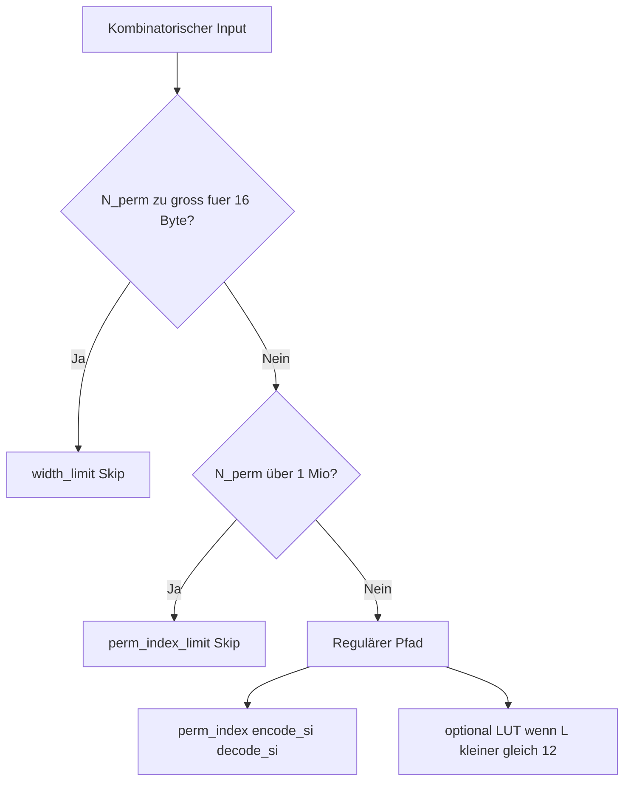

# Performance-Grenzen & Benchmark

Empirische Grenzanalyse über alle **33 AlphabetProfile**. Der Benchmark misst, **wie lang und wie komplex** Text pro Profil sein darf, bevor S/I-Kodierung an kombinatorischen oder Speichergrenzen scheitert.

## Wofür ist das?

Wenn du Text mit `encode_si` kodierst, hängt der Aufwand von der **Anzahl der Permutationen** ab:

```
N_perm = n! / ∏(c_i!)
```

Bei vielen **verschiedenen** Zeichen explodiert `N_perm` (Fakultät). Der Benchmark testet systematisch:

- **Roundtrip** — `encode_si` → `decode_si` liefert den Originaltext zurück
- **Index-Breite** — passt I in 16 Byte?
- **LUT-Eignung** — lohnt sich eine Lookup-Tabelle (nur bei kurzen, wenig permutierten Folgen)?
- **Timing** — wie schnell sind Normalisierung und Substanz pro Zeichen?

Ergebnis: konkrete Regeln wie „max. 8 verschiedene Zeichen für garantierten Roundtrip“ — pro Profil messbar, nicht geschätzt.

## Schnellstart

```bash
cd GPM/functions

# Voll-Sweep (~54 s, ~3.700 Sweep-Punkte)
python -m tools.profile_benchmark

# Smoke-Tests (Teil von run_tests.py)
python run_tests.py
```

## Output-Artefakte

| Datei | Inhalt | Hinweis |
|-------|--------|---------|
| [PROFILE_LIMITS.md](PROFILE_LIMITS.md) | Summary-Tabelle, Duplikat-Matrix, Timing | **Auto-generiert** — nach Benchmark-Lauf neu erzeugt |
| [benchmark_results.json](benchmark_results.json) | JSON-Rohdaten aller Sweep-Punkte | Maschinenlesbar |

**PROFILE_LIMITS.md lesen:** Spalten wie `max_L_roundtrip_unique` = größte getestete Länge mit erfolgreichem Roundtrip bei **L paarweise verschiedenen Zeichen**. `first_fail` = erster Fehlerpunkt im Sweep-Raster.

Detail Perm/Width-Gate: [../referenz/perm.md](../referenz/perm.md) · Tools: [../referenz/tools.md](../referenz/tools.md)

---

## Width-Gate — Schutz vor Permutations-Explosion



Implementierung: [`tools/profile_benchmark.py`](../../tools/profile_benchmark.py) — `width_gate_blocks()`, `width_gate_reason()`.

| Filter | Bedingung | Wirkung |
|--------|-----------|---------|
| `width_limit` | `N_perm.bit_length() > 128` (16-Byte-Index) | Teure Schritte werden übersprungen |
| `perm_index_limit` | `N_perm > 1_000_000` | Blockiert Backtracking in `perm_index` vor Speicher-Overflow |

Bei Skip werden **nicht** ausgeführt: `perm_index`, `build_permutation_lut`, `encode_si`, `decode_si`.

---

## Typische Ergebnisse (Voll-Sweep)

| Kennzahl | Größenordnung |
|----------|---------------|
| Sweep-Punkte | ~3.700 |
| Gesamtlaufzeit | ~54 s |
| Width-Skips | ~167 |
| Roundtrip-Fehler | 0 (bei gültigen Konfigurationen) |

### Muster `all_same` — ein Zeichen wiederholt

`AAAA…` → `N_perm = 1` → Roundtrip bis **L = 64** für alle Profile. Komplexität **O(L)**.

### Muster `unique` — L verschiedene Zeichen

| Länge L | N_perm | Ergebnis |
|---------|--------|----------|
| ≤ 8 | ≤ 40.320 | Roundtrip OK |
| 10 | 3.628.800 | `perm_index_limit` |
| 32+ | astronomisch | Width-Gate |

**Praktische Regel:** Bei **L verschiedenen Zeichen** ist Roundtrip im Sweep-Raster bis **L = 8** verlässlich. Für längere, hoch-entropische Token: kürzere Segmente oder mehr Wiederholungen nutzen.

### LUT-Grenzen

| Konstante | Wert | Bedeutung |
|-----------|------|-----------|
| `MAX_LUT_BUILD_LENGTH` | 12 | LUT nur bis L = 12 |
| `MAX_LUT_BENCHMARK_N` | 10.000 | Zusätzliche Cap im Benchmark |

Darüber: tabellenfreier Pfad (`perm_index` / `perm_decode`).

---

## Sweep-Konfiguration

| Dimension | Werte |
|-----------|-------|
| Profile | 33 (`registry.all_profiles()`) |
| Längen L | 1, 2, 3, 4, 6, 8, 10, 12, 14, 16, 20, 24, 32, 48, 64 |
| Muster | `unique`, `all_same`, `pairs`, `triple`, `max_multiplicity` |

Teststring-Generatoren: [`tools/benchmark_patterns.py`](../../tools/benchmark_patterns.py).

### Felder in PROFILE_LIMITS.md

| Feld | Bedeutung |
|------|-----------|
| `max_L_roundtrip_unique` | Größtes L mit Roundtrip (`unique`) |
| `max_duplicate_count_all_same` | Größtes L mit Roundtrip (`all_same`) |
| `max_L_with_lut` | Größtes L ≤ 12 mit LUT-Build OK |
| `max_N_perm_fits_16` | Größtes N_perm innerhalb 16-Byte-Index |
| `first_fail` | Erster Fehlerpunkt im Sweep |

---

## Was du daraus ableiten kannst

| Frage | Antwort |
|-------|---------|
| Wie lang darf ein Wort mit **allen verschiedenen** Buchstaben sein? | Roundtrip sicher bis **L ≈ 8**; ab L = 10 oft `perm_index_limit` |
| Wie lang darf **ein Buchstabe wiederholt** sein? | Bis **L = 64** getestet, überall OK |
| Wann lohnt LUT? | L ≤ 12 und N_perm ≤ 10.000 |
| Ist Normalisierung langsam? | Nein — selbst komplexe Profile (Mongolian, Hieroglyphen) im Sub-ms-Bereich für Substanz |
| Wie prüfe ich lokal? | `python run_tests.py` + optional `python -m tools.perm_audit` |

---

## CI & Tests

| Befehl | Prüft |
|--------|-------|
| `python run_tests.py` | Smoke inkl. L=1 Roundtrip, Width-Gate |
| `python -m tools.perm_audit` | Anagramm-Invariante aller 33 Profile |

---

## Siehe auch

- [Grundfunktionen](../grundfunktionen/README.md) — S/I-Pipeline
- [Profile](../profile/README.md) — alle 33 AlphabetProfile
- [Doku-Hub](../README.md) — Gesamtübersicht
