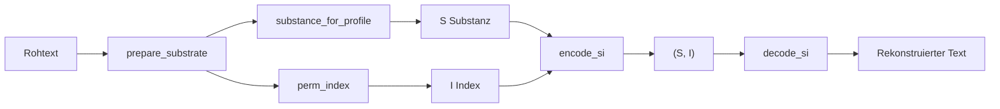

# GPM Grundfunktionen

Referenz für die **S/I-Kernpipeline** in `GPM/functions/`. Alle Pfade relativ zu `GPM/functions/`.

## In 60 Sekunden

Jedes Wort wird als Paar **(S, I)** gespeichert:

- **S (Substanz)** — Produkt aus Primzahlen der Buchstaben. **Reihenfolge egal:** Anagramme haben dasselbe S.
- **I (Index)** — Rang im Permutationsraum. **Reihenfolge wichtig:** Anagramme haben verschiedenes I.

Beispiel (Profil OG):

| Wort | S | I |
|------|---|---|
| `LISTEN` | gleich | z. B. 1234 |
| `SILENT` | **gleich** wie LISTEN | **anders** als LISTEN |

Mit S und I zusammen ist das Wort **eindeutig rekonstruierbar** — `decode_si(S, I, profile)` liefert den Originaltext zurück (nach Profil-Normalisierung).

## Überblick: Symbole und Module

| Symbol | Name | Eigenschaft | Modul |
|--------|------|-------------|-------|
| **S** | Substanz | Kommutativ — Anagramme teilen dasselbe S | `gpm_types/si/substance.py` |
| **I** | Permutations-Index | Ordungsabhängig — Anagramme haben verschiedenes I | `perm/multiset.py`, `gpm_types/si/codec.py` |

Zusätzliche Identitätsmodi (Reihenfolge):

| API | Bedeutung | Profil |
|-----|-----------|--------|
| `Sk(seq)` | Rohes Zeichen-Tuple | profilunabhängig |
| `Sk_lut(seq, profile)` | Tuple via LUT-Rekonstruktion | profil-aware |
| `Sp(seq, profile)` | Positions-Substanz (Prim^Gewicht pro Stelle) | profil-aware |
| `Lut(seq, profile)` | Materialisierte Permutations-LUT | profil-aware |

## Pipeline (End-to-End)



Schritt für Schritt:

1. **`prepare_substrate(raw, profile)`** — Text normalisieren (Groß/Klein, Diakritika, Whitelist je Profil)
2. **`substance_for_profile(seq, profile)`** → **S** — Primzahlprodukt der Zeichen
3. **`perm_index(seq, counts, lex_order)`** → **I** — Rang in der Permutationsreihenfolge
4. **`encode_si` / `decode_si`** — S und I als Ganzzahlen kodieren/dekodieren

**Decode:** `ingredients_for_profile(S, profile)` rekonstruiert die Multimenge (Zeichenhäufigkeiten), `perm_decode(counts, I, lex_order)` rekonstruiert die Zeichenfolge.

### Perm-Invariante (Anagramm-Regel)

Für zwei Strings A, B mit gleicher Multimenge nach Normalisierung, aber unterschiedlicher Anordnung:

- `S(A) = S(B)`
- `I(A) ≠ I(B)`
- `decode_si(S(A), I(A), profile) = A`
- `Sp(A) ≠ Sp(B)` (positionsabhängig)

## Wann brauche ich welche API?

| Ziel | API | Hinweis |
|------|-----|---------|
| Wort eindeutig speichern & zurückholen | `encode_si` / `decode_si` | Standard für Wörter und Token |
| Nur prüfen, ob zwei Wörter Anagramme sind | `substance_for_profile` vergleichen | Gleiches S → gleiche Buchstabenmenge |
| Reihenfolge explizit im Index | `perm_index` / `perm_decode` | Intern in `encode_si` |
| Rohe Zeichenfolge als Tuple | `Sk(seq)` | Ohne Profil |
| Profil-aware Tuple über LUT | `Sk_lut`, `sequence_key_via_lut` | Gleiches Profil wie `encode_si` |
| Positions-abhängige „Substanz“ | `Sp(seq, profile)` | Nicht kommutativ |

## Kernmodule

### `alphabets/`

| Datei | Aufgabe |
|-------|---------|
| `registry.py` | `all_profiles()`, `prime_map_for_profile()`, `lex_order_for_profile()` |
| `normalize.py` | `prepare_substrate()` — profil-spezifische Normalisierung |
| `lex.py` | `build_lex_order()` — selten oben, häufig unten |
| `profiles.py` | `AlphabetProfile` Enum (33 Werte) |

Details zu jedem Profil: [profile/README.md](../profile/README.md).

### `perm/`

| Datei | Aufgabe |
|-------|---------|
| `multiset.py` | `calc_total_perms`, `perm_index`, `perm_decode`, `perm_fits_width` |
| `lut.py` | `build_permutation_lut`, `get_permutation_lut`, `MAX_LUT_BUILD_LENGTH = 12` |

**Permutationsraum:** `N_perm = n! / ∏(c_i!)` — nicht mit der Index-Breite `N(I)` verwechseln.

### `gpm_types/si/`

| Datei | Aufgabe |
|-------|---------|
| `codec.py` | `encode_si`, `decode_si`, `permutation_index_for_profile` |
| `substance.py` | `substance_for_profile`, `ingredients_for_profile` |
| `order.py` | `Sk`, `Sp`, `Sk_lut`, `sequence_key_via_lut`, `Lut` |

#### Profil-Kaskade in `order.py`

Alle LUT-Pfade **müssen** dasselbe Profil wie `encode_si` verwenden:

```python
lut = get_permutation_lut(Counter(sequence), profile)
# → lex_order_for_profile(profile) intern in perm/lut.py
```

Betroffene Funktionen (Default `AlphabetProfile.ROMAN`):

- `sequence_key_via_lut(sequence, profile)`
- `Sk_lut(sequence, profile)`
- `permutation_lut_for_sequence(sequence, profile)`

`Sp` nutzt `prime_map_for_profile(profile)` und physische String-Position — kein LEX-Rang.

## Typen N(I), D(I), H(I)

| Typ | Modul | Kurzbeschreibung |
|-----|-------|------------------|
| N(I) | `gpm_types/ni/` | Reine Ziffernfolgen |
| D(I) | `gpm_types/di/` | Dezimalbrüche |
| H(I) | `gpm_types/hi/` | Segmentierte Hybrid-Identität |

OG-Parität: `encode()` / `decode()` in `codec.py` — nur `AlphabetProfile.OG`.

## Grenzen (Kurzreferenz)

| Grenze | Konstante / Funktion | Wert |
|--------|---------------------|------|
| LUT-Build | `MAX_LUT_BUILD_LENGTH` | L ≤ 12 |
| LUT-Benchmark-Cap | `MAX_LUT_BENCHMARK_N` | N_perm ≤ 10.000 |
| Index-Breite | `perm_fits_width(n, 16)` | 16 Byte Register |
| Perm-Index-Schutz | `MAX_PERM_INDEX_BENCHMARK_N` | N_perm ≤ 1.000.000 |

Ausführlich: [benchmark/README.md](../benchmark/README.md).

## Tests & Audits

```bash
cd GPM/functions

python run_tests.py
python -m tools.perm_audit    # Perm-Invarianten aller 33 Profile
```

| Testmodul | Prüft |
|-----------|-------|
| `tests/alphabets/test_perm_identity_all_profiles.py` | Anagramm S/I, LUT-Kaskade, perm_index |
| `tests/alphabets/test_profiles_multiscript.py` | Roundtrip, LUT, Map-Größe pro Profil |
| `tests/benchmark/test_profile_limits_smoke.py` | L=1 Roundtrip, Width-Gate (CI) |
| `tests/test_sequence_key.py` | Sk, Sp, sequence_key_via_lut |
| `tests/parity/test_si.py` | OG-Parität |

## Siehe auch

- [Profile](../profile/README.md) — alle 33 AlphabetProfile
- [Analyse](../analyse/README.md) — Text kompilieren, vergleichen, `.gpm`
- [Benchmark](../benchmark/README.md) — Performance-Grenzen
- [Doku-Hub](../README.md) — Gesamtübersicht
