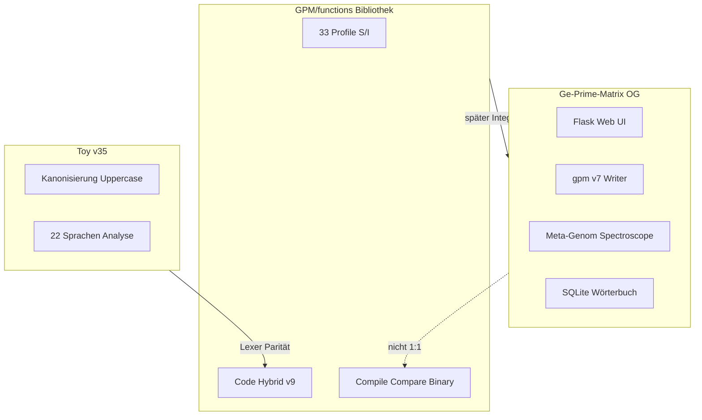

# OG vs GPM — drei Schichten

Ge-Prime-Matrix existiert als **Web-App** (OG) und als **Bibliothek** (GPM/functions). Toy v35 ist eine separate HTML-Analyse.

## Ziele

| Schicht | Ziel |
|---------|------|
| **GPM/functions** | Bitgenaue Rekonstruktion, 33 Profile, v9, Code/Hybrid, Bibliotheks-API |
| **OG Web-App** | Editor, HTTP-API, v7-Produktion, Linguistik, Cipher, DB-Korpus |
| **Toy v35** | Normalisierte Redundanz-Analyse (Kommentare weg, Uppercase) |

## Formate

| Format | OG | GPM/functions |
|--------|-----|---------------|
| Schreiben | v7 Standard | **v9** Standard |
| Lesen | v1–v7 | v4, v8, v9, v7 best-effort |
| Block-Tree | — | `FLAG_BLOCK_TREE` in v9 |
| GPC-Verschlüsselung | ja | nein (Roadmap) |

## Was wo liegt

| Feature | GPM | OG |
|---------|-----|-----|
| compile_text / reconstruct | ja | ja (parallel) |
| Code + Hybrid bitgenau | **ja** | nein |
| 33 Schriftprofile | **ja** | OG-Profil + Roman |
| Meta-Genom | nein | **ja** |
| Spectroscope | Index-Basis | **ja** UI |
| Cipher / GPC | nein | **ja** |
| Linguistik + DB | nein | **ja** |

## Toy vs GPM Code

GPM **importiert nicht** Toy-Kanonisierung in den Default-Pfad. Optional: `canonicalize_for_analysis()`.

## Weiter

- [portiert.md](portiert.md) — was schon angekommen ist
- [roadmap.md](roadmap.md) — was noch in OG bleibt
- [modul-karte.md](modul-karte.md) — Pfad-für-Pfad
- [../analyse/README.md](../analyse/README.md)
