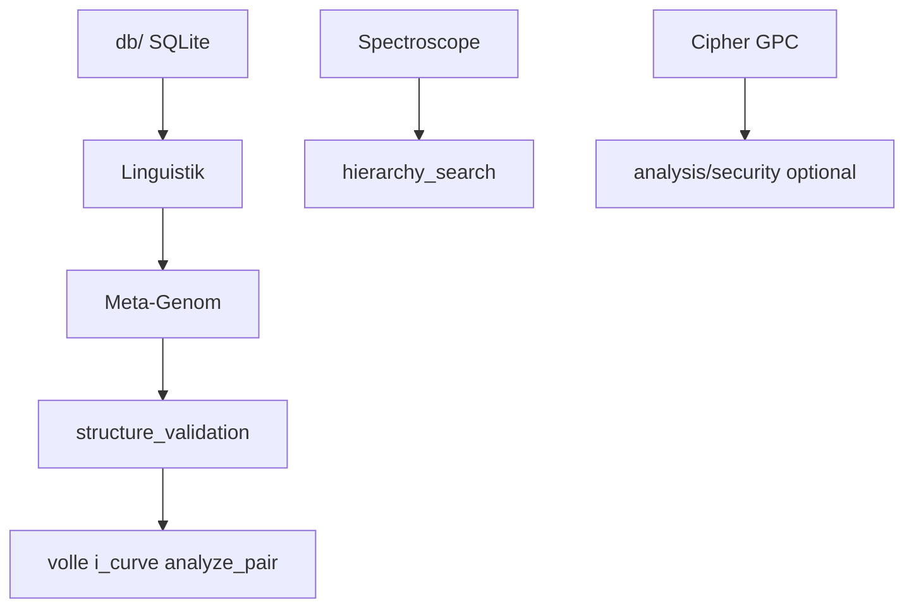

# OG-Roadmap — bewusst noch in der Web-App

Diese Features liegen in [`Ge-Prime-Matrix OG/`](../../../Ge-Prime-Matrix%20OG/) und sind **nicht** Teil der Bibliothek, sofern unten nicht anders vermerkt.

## Portiert in GPM/functions (Phasen 5–9)

| OG-Modul | GPM-Äquivalent |
|----------|----------------|
| `ge_prime/spectroscope.py` | `analysis/search/spectroscope.py` |
| `ge_prime/hierarchy_search.py` | `analysis/search/hierarchy_search.py` |
| `ge_prime/i_curve.py` (voll) | `analysis/curves/i_curve.py`, `analyze_pair_full` |
| `ge_prime/cipher.py`, `gpm/cipher_wrap.py` | `analysis/security/cipher.py`, `analysis/binary/gpc.py` |
| `gpm/reader.py` search_by_* | `analysis/binary/search.py` |
| Meta-Genom (Kern) | `analysis/meta/` |
| Anagramm-Korpus | `analysis/corpus/protocol.py` (Protokoll-Stub) |
| Algebra + Basis-Layer (Phase 4b+) | `analysis/algebra/`, `analysis/basis/` |

## Phase 4b+ — Algebra & Basis-Layer

| Modul | Nutzen |
|-------|--------|
| `analysis/algebra/` | Gates, Fold, Log-Profil-Metriken, Multiset, substance_kernel |
| `analysis/algebra/fusion.py` | Gewichts-Fusion (Phase F-B) |
| `analysis/algebra/window_fold.py` | Fenster-Fold, `exponent_window_to_substance` (Phase F-A) |
| `analysis/algebra/i_metrics.py` | I-Ratio-Metriken (Phase E-B) |
| `analysis/basis/` | Signature, invertierter Index, Tiered Compare, Korpus-API |
| `analysis/basis/compare_tiered.py` | Gestaffelter Vergleich Tier 0–4 (Phase F5) |

Doku: [../analysis/algebra-layer.md](../analysis/algebra-layer.md), [../analysis/basis-layer.md](../analysis/basis-layer.md)

### Phasen D–F (Härtungs-Invarianten)

| Phase | Schwerpunkt |
|-------|-------------|
| **D** | sparse_counter O(k), coupled I×S, Guard-Audit |
| **E** | Log-LCM-Pfad, i_ratio-Guard, typed_sketch-Gewicht 0 |
| **F** | substance_kernel-Dispatcher, zentralisierte Fenster-LCM, fusion-Gewichte |

## Priorität 1 — noch offen

| OG-Modul | Nutzen | Abhängigkeit |
|----------|--------|--------------|
| `ge_prime/linguistics/` (Sprache/Domäne mit DB-Tier) | Korpus-Audit | **db/** SQLite — bewusst nicht portiert |
| `db/` + Scraper-Ökosystem | Wort-Korpus | durch `analysis/corpus/protocol.py` ersetzt (Stub) |

## Priorität 2 — Utilities

| OG-Modul | Nutzen |
|----------|--------|
| `pipeline/size_compare.py` | Speicher-Vergleich GPM vs TXT/PDF/… |
| SQLite-Implementierung von `AnagramCorpus` | Externe Anagramm-Suche |

## Siehe auch

- [og-vs-gpm.md](og-vs-gpm.md)
- [portiert.md](portiert.md)
- [modul-karte.md](modul-karte.md)
