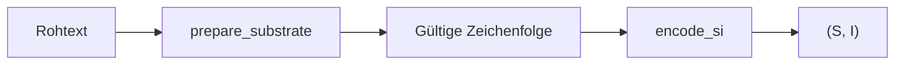

# GPM Alphabet-Profile

Alle implementierten Schriftprofile in `GPM/functions/alphabets/`. Ein Profil legt fest, **welche Zeichen** in einem Text erlaubt sind und **wie** sie in S/I kodiert werden.

## Was ist ein AlphabetProfile?

Jedes der **33 Profile** definiert drei Säulen:

| Säule | Bedeutung | Beispiel |
|-------|-----------|----------|
| **Prime-Map** | Jedes erlaubte Zeichen → eigene Primzahl (injektiv, disjunkte Blöcke pro Profil) | `A → 3`, `B → 5` (OG) |
| **Normalisierung** | Rohtext → gültige Zeichenfolge (`prepare_substrate`) | NFC, Großschreibung, Matra-Strip |
| **LEX-Order** | Reihenfolge für Permutations-Rang (selten oben, häufig unten) | Frequenz-LEX bei ROMAN |



Registry-Zentralstelle: `alphabets/registry.py` — `all_profiles()`, `prime_map_for_profile()`, `lex_order_for_profile()`.

## Deep Dive

| Thema | Seite |
|-------|-------|
| Normalisierung pro Schriftfamilie | [normalisierung.md](normalisierung.md) |
| Primzahl-Blöcke & Registry | [prime-blocks.md](prime-blocks.md) |
| S/I-API im Detail | [../referenz/gpm_types/si.md](../referenz/gpm_types/si.md) |
| API-Index | [../referenz/index.md](../referenz/index.md) |

### Beispiele nach Profil-Familie

**Latin (OG / ROMAN):** 27 Buchstaben A–Z (+ ß nur OG). ROMAN nutzt frequenzbasierte LEX-Reihenfolge für deutsche Texte.

**Indisch (Bengali, Telugu, Gurmukhi, Tamil):** Nur **Basis-Konsonanten** bleiben — Matras, Vokale und combining marks werden entfernt. 35 Zeichen statt voller Silbenschriften.

**Hieroglyphen (Aesthetic Hieroglyphs):** Über 800 Gardiner-Glyphen werden auf **24 Uniliterale** gemappt; unbekannte Glyphen werden still verworfen (kein Pass-Through).

## Profil-Liste (Nachschlag)

| Profil | `.value` | Zeichen | Normalisierung / Besonderheit |
|--------|----------|---------|-------------------------------|
| OG | `og` | 27 | Frozen Referenz; LEX = Unicode-Sort |
| ROMAN | `roman` | 27 | Frequenz-LEX (Deutsch/Latin); ohne Ω |
| GREEK | `greek` | 24 | NFC + upper |
| CYRILLIC | `cyrillic` | 33 | NFC + upper; Ё in Map |
| ARABIC | `arabic` | 28 | NFC, Alef-Vereinheitlichung |
| HEBREW | `hebrew` | 22 | NFC, Niqqud strip |
| DEVANAGARI | `devanagari` | 46 | NFC, virama strip |
| THAI | `thai` | 48 | NFC |
| HANGUL | `hangul` | 51 Jamo | NFKD → Jamo-Zerlegung |
| HIRAGANA | `hiragana` | 46 | NFC, Dakuten→Basis |
| KATAKANA | `katakana` | 46 | NFC, Dakuten→Basis |
| ARMENIAN | `armenian` | 38 | NFC + upper |
| GEORGIAN | `georgian` | 33 | NFC |
| GURMUKHI | `gurmukhi` | 35 | Matra-Map → Mn-Strip → Whitelist |
| TAMIL | `tamil` | 30 | Matra/Pulli-Map → Mn-Strip |
| AMHARIC | `amharic` | 34 | NFKD, Silbe→Ge'ez-Basis |
| COPTIC | `coptic` | 32 | NFC + upper |
| RUNIC | `runic` | 24 | NFC, Rundata-LEX |
| PHOENICIAN | `phoenician` | 22 | SMP-sichere Whitelist |
| UGARITIC | `ugaritic` | 30 | SMP-sichere Whitelist |
| OGHAM | `ogham` | 20 | NFC, Whitelist |
| GLAGOLITIC | `glagolitic` | 41 | NFC + upper |
| GOTHIC | `gothic` | 27 | SMP-sichere Whitelist |
| MONGOLIAN | `mongolian` | 35 | Positionsform→Basis, FVS-Strip |
| THAANA | `thaana` | 24 | NFC, Whitelist |
| TIFINAGH | `tifinagh` | 33 | NFC, Whitelist (IRCAM) |
| BENGALI | `bengali` | 35 | Konsonanten-Kern (Gurmukhi-Pipeline) |
| TELUGU | `telugu` | 35 | Konsonanten-Kern (Gurmukhi-Pipeline) |
| JAVANESE | `javanese` | 20 | Hanacaraka-Kern (U+A992–A9A5) |
| OLD_PERSIAN | `old_persian` | 36 | SMP-sichere Whitelist |
| AESTHETIC_HIEROGLYPHS | `aesthetic_hieroglyphs` | 24 | Gardiner-Map → hermetischer Endfilter |
| OLD_ITALIC | `old_italic` | 26 | SMP + upper |
| OLD_TURKIC | `old_turkic` | 38 | SMP-sichere Whitelist |

## Prime-Blöcke

- **OG / ROMAN** teilen Primzahlen 2–103 (ß = 103 nur OG)
- Ab **GREEK** fortlaufende disjunkte Blöcke via `alphabets/primes.py`
- Kein Symbol aus Profil A ist in Profil B gültig (Prime-Kollision ausgeschlossen)

## Reduktionsphilosophie

| Familie | Strategie |
|---------|-----------|
| Indisch (Bengali, Telugu, Gurmukhi, Tamil) | Nur Basis-Konsonanten; Matras/Vokale/Mn restlos entfernt |
| Javanese | 20 Hanacaraka-Aksara; Pasangan/Wyanjana verworfen |
| Aesthetic Hieroglyphs | 800+ Gardiner-Glyphen → 24 Uniliterale via `gardiner_map.py` |
| Mongolian | Positionsformen → isolierte Basiszeichen |

### Logogramm-Leak-Verbot (Aesthetic Hieroglyphs)

Ideogramme, Götterfiguren, Gebäude und unbekannte Glyphen werden **silent discarded** — kein `raise`, kein Pass-Through. Nur Zeichen in `CHAR_AESTHETIC_HIEROGLYPHS_SET` oder gültige Gardiner-Map-Ziele landen im Substrat.

## SMP-Codepoints

Für Phoenician, Ugaritic, Gothic, Old Persian, Old Italic, Old Turkic, Aesthetic Hieroglyphs: `alphabets/unicode_utils.py` verbindlich (atomare Codepoints, keine Surrogate).

## Design-Grenzen (nicht unterstützte Zeichensätze)

Diese Schriftsysteme sind **bewusst nicht** als `AlphabetProfile` implementiert — aus technischen Gründen, nicht als zeitliche Roadmap:

| Zeichensatz | Grund |
|-------------|-------|
| Volles Gardiner-Set (800+ Hieroglyphen) | Nur 24-Uniliteral-Reduktion ist definiert |
| CJK / Kanji | Prime-Allocator-Explosion |
| Tibetan / Khmer | Ligatur-Cluster ohne Rendering-Engine |
| Burmese / Sinhala | Kombinatorische Sonderformen |

## API-Nutzung

```python
from alphabets.profiles import AlphabetProfile
from alphabets.registry import all_profiles, lex_order_for_profile
from alphabets.normalize import prepare_substrate
from gpm_types.si.codec import encode_si, decode_si

profile = AlphabetProfile.GREEK
raw = "ΑΘΗΝΑ"
s, i = encode_si(raw, profile)
assert decode_si(s, i, profile) == prepare_substrate(raw, profile)
```

## Perm-Verhalten pro Profil

Jedes Profil unterscheidet Permutationen über **eigenes LEX** (`lex_order_for_profile`). Die Anagramm-Invariante (gleiches S, verschiedenes I) gilt für alle 33 Profile.

```bash
python -m tools.perm_audit
```

Tests: `tests/alphabets/test_perm_identity_all_profiles.py`, `tests/alphabets/test_profiles_multiscript.py`.

## Epigraphische LEX-Quellen

| Profil | Quelle |
|--------|--------|
| RUNIC | Rundata-Korpus |
| OLD_PERSIAN | Behistun-Inschrift |
| AESTHETIC_HIEROGLYPHS | Sinuhe / Mittelägyptisch (Uniliterale) |
| OLD_ITALIC | Etruskische Inschriften |
| OLD_TURKIC | Orkhon-Inschriften |
| BENGALI / TELUGU | Wikipedia/News-Korpus-Schätzung |

## Ordnerstruktur

```
alphabets/
  og/ roman/ greek/ cyrillic/
  arabic/ hebrew/ devanagari/ thai/
  hangul/ hiragana/ katakana/
  armenian/ georgian/ gurmukhi/ tamil/
  amharic/ coptic/ runic/
  phoenician/ ugaritic/ ogham/ glagolitic/ gothic/
  mongolian/ thaana/ tifinagh/
  bengali/ telugu/ javanese/
  old_persian/ aesthetic_hieroglyphs/ old_italic/ old_turkic/
  registry.py  normalize.py  lex.py  profiles.py  primes.py
```

## Siehe auch

- [Normalisierung](normalisierung.md) — Regeln pro Schriftfamilie
- [Primzahl-Blöcke](prime-blocks.md) — disjunkte Registry
- [Grundfunktionen](../grundfunktionen/README.md) — S/I-Pipeline
- [Benchmark](../benchmark/README.md) — empirische Grenzwerte pro Profil
- [Referenz-Index](../referenz/index.md)
- [Doku-Hub](../README.md) — Gesamtübersicht
