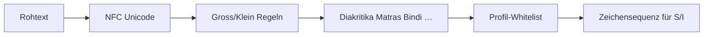

# Normalisierung pro Schriftfamilie

Wie Rohtext vor der Substanz-Berechnung transformiert wird. Implementierung: `alphabets/` pro `AlphabetProfile`.



## Schriftfamilien

| Familie | Profile (Beispiele) | Besonderheiten |
|---------|---------------------|----------------|
| **Latin / OG** | OG, ROMAN | ß → ein Zeichen; Umlaute |
| **Griechisch** | GREEK | Ω vs ω; lex order ≠ Unicode |
| **Kyrillisch** | CYRILLIC | Yo, Soft/Hard Signs |
| **Indisch** | DEVANAGARI, BENGALI, … | Matras/Vowel Signs entfernen |
| **CJK-artig** | HANGUL | Silben-Decomposition |
| **SMP Epigraphik** | GOTHIC, RUNIC, … | Codepoint-Atomizität |
| **Hieroglyphen** | AESTHETIC_HIEROGLYPHS | Gardiner-Mapping; Logogramme verwerfen |

## Beispiele

### OG / Roman

| Input | Normalisiert | Hinweis |
|-------|--------------|---------|
| `Größe` | ß/umlaut behandelt | nicht `ss` expandiert |
| `HELLO` | profilabhängig | Case in OG-Profil |

### Indisch (Devanagari)

Vowel Signs (Matras) werden **gestrippt** — Konsonant-Kern bleibt für Substanz.

### Hieroglyphen

Nur Uniliterale aus Whitelist; Ideogramme **silent discard** (kein Leak in S).

## API

Normalisierung läuft über:

```python
from alphabets.preparation import prepare_substrate
from alphabets import AlphabetProfile

seq = prepare_substrate("Größe", AlphabetProfile.OG)
```

## Grenzen

| Ausgeschlossen | Grund |
|----------------|-------|
| CJK (Han) | Kein Profil |
| Tibetan, Khmer, … | Kein Profil |

Vollständige Liste: [README.md](README.md).

## Siehe auch

- [README.md](README.md) — 33-Profile-Tabelle
- [prime-blocks.md](prime-blocks.md)
- [../grundfunktionen/README.md](../grundfunktionen/README.md)
- Tests: `tests/alphabets/test_profiles_multiscript.py`
