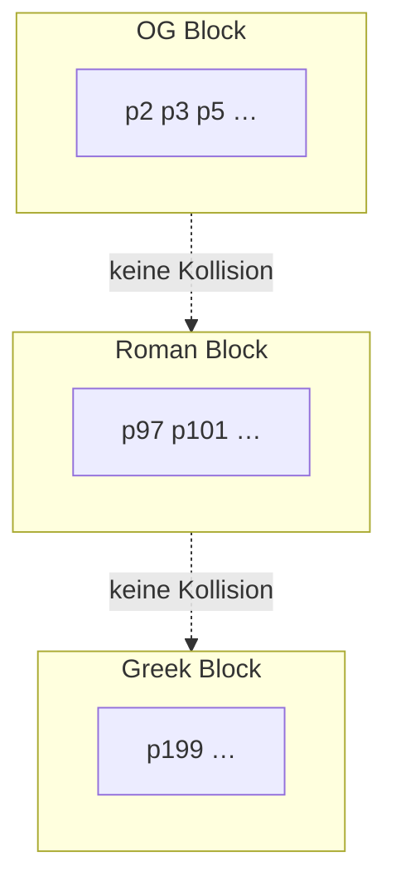

# Primzahl-Blöcke & Registry

Warum Profile **disjunkte Primzahl-Bereiche** nutzen und wie die Registry das absichert.



## Idee

Jedes `AlphabetProfile` mappt Zeichen auf **eigene Primzahlen**. Substanz S = Produkt — Zeichen aus verschiedenen Profilen kollidieren nicht, wenn Blöcke disjunkt sind.

## Registry

Modul: `alphabets/registry.py`

| Prüfung | Bedeutung |
|---------|-----------|
| `disjoint_prime_blocks` | Kein Prim in zwei Profil-Blöcken |
| `thirty_three_profiles` | Vollständigkeit der Enum |

Test: `tests/alphabets/test_registry.py`

## OG vs Multiscript

| | OG (27 Buchstaben) | GPM 33 Profile |
|---|-------------------|----------------|
| Prim-Basis | A–Z + ß | Pro Profil eigener Block |
| Parität | `tests/parity/test_alpha_og.py` | Multiscript-Erweiterung |

## Beispiel — gleiches Wort, verschiedene Profile

```python
from alphabets import AlphabetProfile
from gpm_types.si.substance import substance_for_profile

s_og = substance_for_profile("A", AlphabetProfile.OG)
s_roman = substance_for_profile("A", AlphabetProfile.ROMAN)
# s_og != s_roman — verschiedene Prim-Mappings
```

## Siehe auch

- [README.md](README.md)
- [normalisierung.md](normalisierung.md)
- [../referenz/gpm_types/si.md](../referenz/gpm_types/si.md)
