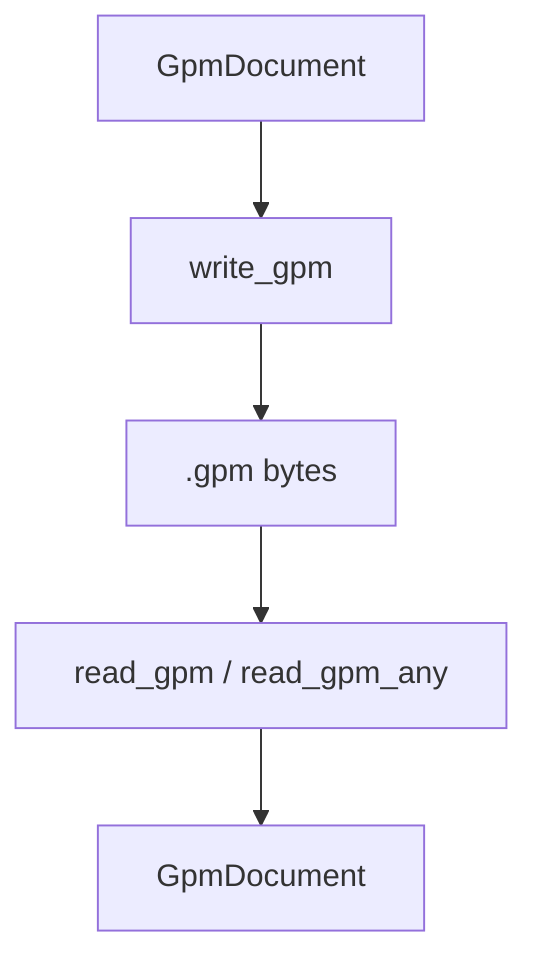
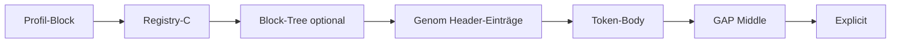

# .gpm Binärformat

Speicherung kompilierter Dokumente. Modul: `analysis/binary/format.py`, `compat.py`, `reader.py`.



## Versionen

| Version | Standard | Besonderheiten |
|---------|----------|----------------|
| **4** | Legacy | Flaches Layout, OG-lesbar |
| **8** | Profil | + `AlphabetProfile` im Header |
| **9** | **Default** | + Fraktal-Geometrie, Registry-C, GAP-RLE, optional Block-Tree |

Konstante: `analysis.binary.format.VERSION` (= 9).

## Datei-Header (29 Byte)

| Offset | Inhalt |
|--------|--------|
| 0–2 | Magic `GPM` |
| 3 | Version |
| 4 | Flags (Bitmask) |
| 5–8 | Header-Einträge (Wörter) |
| 9–12 | Body-Tokens |
| 13–16 | Separator-Perm / reserviert |
| 17–20 | Explicit-Anzahl |
| 21–24 | Middle-Block-Länge (Gaps) |
| 25–28 | Payload-Länge |

## Flags

| Flag | Wert | Bedeutung |
|------|------|-----------|
| `FLAG_BODY_CELL` | 0x01 | Zell-Geometrie aktiv |
| `FLAG_BODY_HIER` | 0x02 | Hierarchie aktiv |
| `FLAG_STRUCT` | 0x04 | Struktur-Layer |
| `FLAG_GAP_RLE` | 0x08 | GAP run-length-kodiert |
| `FLAG_PROFILE` | 0x10 | Profilname im Payload |
| `FLAG_FRACTAL` | 0x20 | Registry-C + Geometrie |
| `FLAG_BLOCK_TREE` | 0x40 | Code-/Block-Baum eingebettet |

## Payload-Reihenfolge (v9)



Block-Tree: 4-Byte Länge + `encode_block_tree(root_block)` wenn `FLAG_BLOCK_TREE`.

## I/O-API

| Funktion | Parameter | Rückgabe | Beschreibung |
|----------|-----------|----------|--------------|
| `write_gpm` | `document`, optional `version`, `use_gap_rle` | `bytes` | Serialisieren |
| `read_gpm` | `bytes` | `GpmDocument` | v4/v8/v9 |
| `read_gpm_any` | `bytes` | `GpmDocument` | inkl. v7 best-effort |
| `load_gpm` | `path` | `GpmDocument` | Datei lesen |
| `analyze_gpm` | `path` oder bytes | `GpmAnalysis` | Metadaten |

## GAP-RLE

Standard-Hierarchie liefert **ableitbare** Gaps; Abweichungen werden kompakt als RLE-Map gespeichert. Rekonstruktion: `derive_gaps` + `merge_gaps`. Siehe [geometrie.md](geometrie.md).

## Registry-C (v9)

Code- und Geometrie-Literale (PointerKind C) mit Substanz, Perm-Raum, Origin-Byte. Wird bei `FLAG_FRACTAL` geschrieben.

## Beispiel

```python
from alphabets import AlphabetProfile
from analysis.compile.compiler import compile_text_to_gpm
from analysis.binary.format import read_gpm, VERSION, write_gpm
from analysis.binary.compat import read_gpm_any
from analysis.compile.reconstruct import reconstruct_text

doc, blob, _ = compile_text_to_gpm("Hallo.", AlphabetProfile.OG, version=VERSION)
assert blob[3] == VERSION

loaded = read_gpm(blob)
assert reconstruct_text(loaded) == "Hallo."

# OG v7 (best-effort):
# doc7 = read_gpm_any(open("legacy.gpm","rb").read())
```

## Hybrid → v9

```python
from analysis.code.compile import compile_hybrid_to_gpm

text = "# Titel\n\n```py\nx = 1\n```\n"
doc, blob = compile_hybrid_to_gpm(text)
# doc.root_block = Code-Modul; doc.registry = Code-Registry
```

## Grenzen

- Maximale String-Länge pro Feld: 1 MiB
- Middle-Block max. 16 MiB
- v7-Lesen ist best-effort — volle OG-Hierarchie ggf. nicht rekonstruiert
- Gelesener Block-Tree ersetzt nicht automatisch neu berechneten NL-Baum

## Siehe auch

- [datenmodell.md](datenmodell.md)
- [geometrie.md](geometrie.md)
- [code/compile-hybrid.md](code/compile-hybrid.md)
- [tutorials/og-v7-nach-v9.md](../tutorials/og-v7-nach-v9.md)
- [og/og-vs-gpm.md](../og/og-vs-gpm.md)
- Tests: `tests/analysis/test_binary.py`, `test_v9_binary.py`, `test_v9_hybrid.py`
