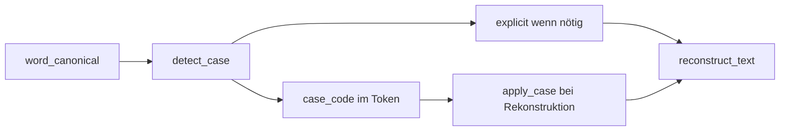

# Case-Policy

Groß/Klein-Speicherung in `.gpm`-Header und Body. Modul: `analysis/case/`.



## Funktionen

| Funktion | Modul | Beschreibung |
|----------|-------|--------------|
| `detect_case(original, normalized)` | `case.detect` | Case-Code ermitteln |
| `apply_case(original, case_code)` | `case.apply` | Schreibweise wiederherstellen |
| `CaseStoragePolicy` | `case.policy` | Speicher-Modi |
| `DEFAULT_CASE_POLICY` | `case.policy` | Standard für `.gpm` |

## Explicit-Einträge

Wenn `case_code` die Original-Schreibweise nicht eindeutig encodiert (z. B. `iPhone`, ß-Sonderfälle), landet das Wort in `document.explicit` als `(token_index, text)`.

## Beispiel

```python
from alphabets import AlphabetProfile
from analysis.compile.compiler import compile_text
from analysis.compile.reconstruct import reconstruct_text

doc, _ = compile_text("Straße", AlphabetProfile.OG)
assert reconstruct_text(doc) == "Straße"
```

## Grenzen

- Case-Policy gilt für **NL**-Wörter, nicht für Code-Literale (die sind exakt in Registry).

## Siehe auch

- [compile.md](compile.md)
- [datenmodell.md](datenmodell.md)
- Tests: `tests/analysis/test_case.py`
