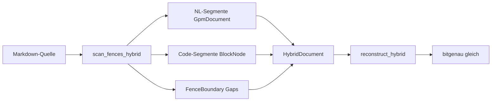

# Hybrid & Markdown-Fences

Markdown mit `` ```lang ``-Fences. Module: `analysis/code/compile.py`, `context.py`, `hybrid.py`, `canonicalize.py`.



## Gap-Erhaltungs-Invariante

Leerzeilen und Spaces **um** Fence-Zeilen gehören **nicht** in NL-Gaps oder Code-`nl` — sie sitzen an `FenceBoundary.prefix_gap`.

**Falsch wäre:** Fence-Newline in `token.nl` des ersten Code-Tokens.  
**Richtig:** Fence-Zeile als eigene Grenze, dann Code-Body ab nächster Zeile.

## Kern-API

| Funktion | Rückgabe | Beschreibung |
|----------|----------|--------------|
| `compile_hybrid(text, profile)` | `HybridDocument` | Scan + kompilieren |
| `reconstruct_hybrid(doc)` | `str` | Markdown 1:1 |
| `verify_hybrid_reversibility(text)` | `bool` | Round-Trip |
| `compile_hybrid_to_gpm(text)` | `(GpmDocument, bytes)` | v9 mit Block-Tree |
| `hybrid_to_gpm_document(hybrid)` | `GpmDocument` | NL merge + Code-Registry |
| `scan_fences_hybrid(source)` | `list[ScannedSegment]` | Low-level Scanner |

## Fence-Sprachen

`resolve_fence_language("javascript")` → `"js"`. Aliases in `languages.py`:

| Alias | id |
|-------|-----|
| python, python3 | py |
| javascript, typescript | js |
| bash, shell | sh |

## Optional: Kanonisierung (Toy-Parität)

**Nicht** im Default-Pfad:

```python
from analysis.code.canonicalize import canonicalize_for_analysis

norm = canonicalize_for_analysis(source, "js", uppercase=False)
# stripCommentsAware + NFC — nur für Redundanz-Vergleich
```

## Beispiel

```python
from alphabets import AlphabetProfile
from analysis.code.compile import compile_hybrid, verify_hybrid_reversibility
from analysis.code.decompile import reconstruct_hybrid

src = "Title\n\n```py\nif True: pass\n```\n"
doc = compile_hybrid(src, AlphabetProfile.OG)
assert reconstruct_hybrid(doc) == src
assert verify_hybrid_reversibility(src)
```

## v9-Export

```python
from analysis.code.compile import compile_hybrid_to_gpm

_, blob = compile_hybrid_to_gpm(src)
# FLAG_BLOCK_TREE gesetzt wenn Code-Segment vorhanden
```

## Grenzen

- Nur `` ``` `` und `~~~` Fences (kein indented code blocks ohne Fence)
- `IGNORED_SUFFIXES` (.min.js, Binaries) — kein Auto-Compile per Dateiendung in Fences

## Siehe auch

- [tokenizer.md](tokenizer.md)
- [../binary-format.md](../binary-format.md)
- [tutorials/hybrid-markdown.md](../../tutorials/hybrid-markdown.md)
- Tests: `test_code_hybrid_gaps.py`, `test_v9_hybrid.py`, `test_fence_aliases.py`
