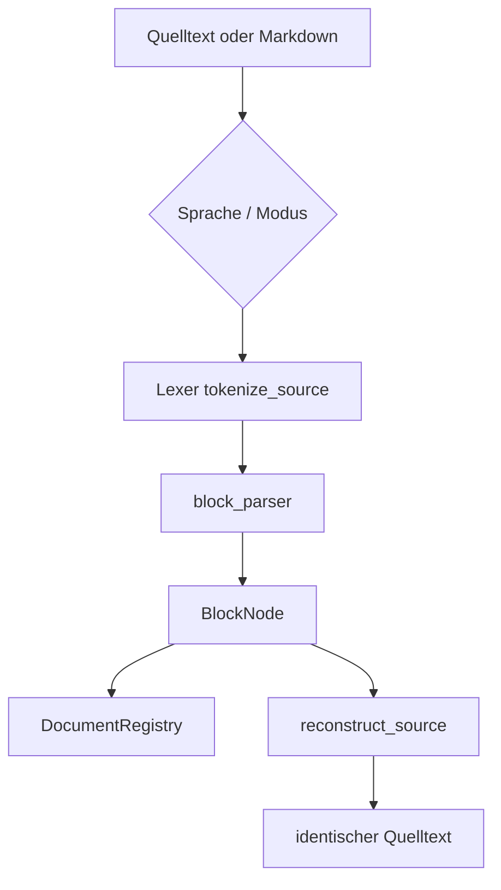

# Code-Analyse — Übersicht

Bitgenaue Verarbeitung von **Programmiersprachen** und **Hybrid-Markdown**. Modul: `analysis/code/`.

## Module

| Modul | Rolle |
|-------|------|
| `languages.py` | 19 Sprachen, Keywords, Fence-Aliases |
| `tokenizer.py` | Lexer-Stile: indent, brace, tag, keyword, flat |
| `block_parser.py` | Token → BlockNode-Baum |
| `compile.py` | `compile_source`, Hybrid, v9-Export |
| `decompile.py` | Rekonstruktion |
| `hybrid.py` | `HybridDocument`, Fence-Grenzen |
| `context.py` | Fence-Scanner |
| `canonicalize.py` | Optional Toy-ähnliche Normalisierung |

## Detailseiten

| Thema | Seite |
|-------|-------|
| Lexer, Guards, Sprachen | [tokenizer.md](tokenizer.md) |
| Hybrid & Fences | [compile-hybrid.md](compile-hybrid.md) |
| Datenstrukturen | [../datenmodell.md](../datenmodell.md) |
| v9 mit Block-Tree | [../binary-format.md](../binary-format.md) |

## Kern-API

| Funktion | Beschreibung |
|----------|--------------|
| `compile_source(source, language_id, registry)` | → `BlockNode` |
| `reconstruct_source(module, registry)` | → Quelltext |
| `verify_reversibility(source, lang, registry)` | Round-Trip bool |
| `compile_source_file(path, registry)` | Endung → Sprache |

## Parse-Kontexte

Code und NL teilen sich **nicht** die Registry-Semantik:

- Prosa: `if` → Wort (S)
- Python-Fence: `if` → Keyword (C)

Siehe `tests/analysis/test_code_interference.py`.

## Siehe auch

- [Analyse-Überblick](../../analyse/README.md)
- [tutorials/code-bitgenau.md](../../tutorials/code-bitgenau.md)
- [tutorials/hybrid-markdown.md](../../tutorials/hybrid-markdown.md)
