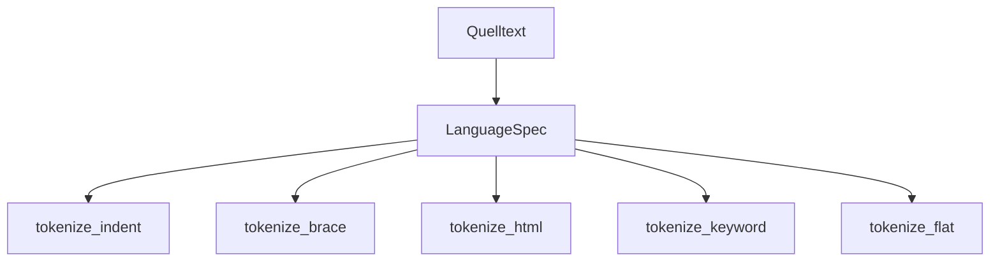
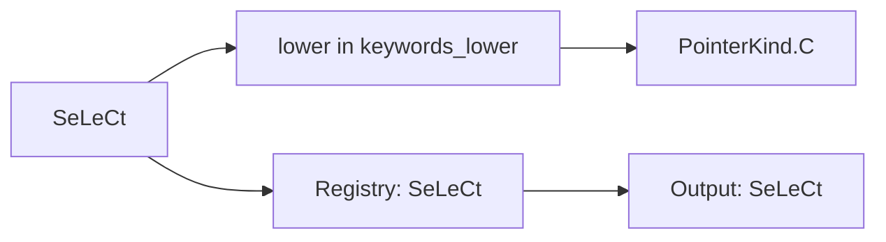
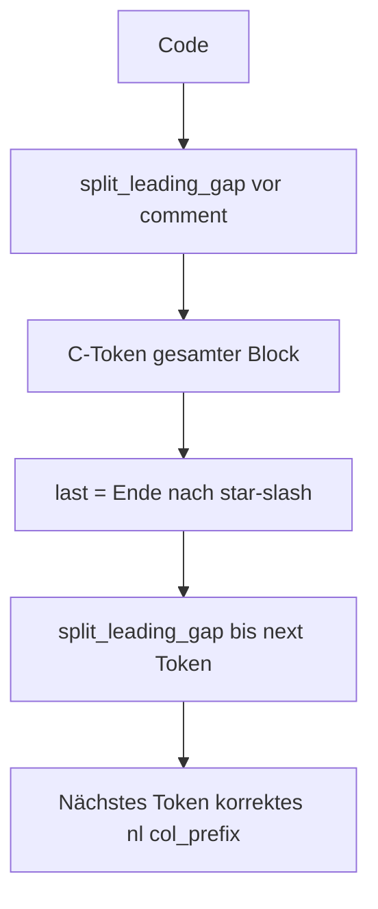

# Code-Tokenizer

Scalar-Lexer mit **nl/col_prefix**-Invariante. Modul: `analysis/code/tokenizer.py`, `comments.py`, `languages.py`.

## Lexer-Stile

| Stil | Sprachen | `{` `[` Verhalten |
|------|----------|------------------|
| **indent** | Python | Einrückung = Block open/close |
| **brace** | JS, C, Java, Go, … | `{`/`[` = Block open (bracket-Style für `[`) |
| **tag** | HTML, XML | Tags = Block open/close |
| **keyword** | Ruby, Shell, SQL | Keywords = Block open/close |
| **flat** | JSON, TOML, Markdown | `{`/`[` = nur C-Token, keine Blöcke |

Routing: `tokenize_source(source, language_id)` → `language_for_id().block_style`.



## Guards (Pflicht-Invarianten)

### Guard A — Case-Preservation

SQL/Ruby/Shell: Keyword-Match über `keywords_lower`; **Quelltext-Slice unverändert** in Token und Registry.



### Guard B — Multiline-Kommentare

`/* … */` = **ein** C-Token; inneres `\n` wird **nicht** dem nächsten Token als `nl` zugeschlagen.



## Funktionen

| Funktion | Beschreibung |
|----------|--------------|
| `tokenize_source` | Einstieg nach Sprache |
| `tokenize_brace` | C-Stil + Kommentar-Scan |
| `tokenize_keyword` | SQL/Ruby/Shell |
| `tokenize_flat` | JSON/TOML/MD |
| `tokenize_indent` | Python |
| `tokenize_html` | HTML/XML |
| `classify_code_token` | S/N/D/C Zuordnung |
| `normalize_line_endings` | CRLF → LF |

## Sprach-Matrix

Vollständige Tabelle: [analyse/README.md](../../analyse/README.md#unterstützte-sprachen).

Konfiguration: `analysis/code/languages.py` — `LanguageSpec`, `FENCE_LANG_ALIASES`, `IGNORED_SUFFIXES`.

## Beispiel

```python
from analysis.code.tokenizer import tokenize_source
from analysis.code.languages import language_for_id

spec = language_for_id("sql")
res = tokenize_source("SeLeCt 1;\n", "sql")
assert res.tokens[0].value == "SeLeCt"  # Case erhalten
```

## Grenzen

- JSX in JavaScript nicht unterstützt
- Python `\` Zeilenfortsetzung nicht unterstützt
- TOML `#`-Kommentare in flat-Modus eingeschränkt

## Siehe auch

- [compile-hybrid.md](compile-hybrid.md)
- [../datenmodell.md](../datenmodell.md)
- Tests: `test_code_tokenizer_guards.py`, `test_code_languages.py`, `test_tokenize_keyword.py`
