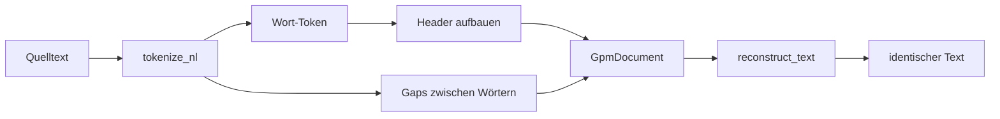
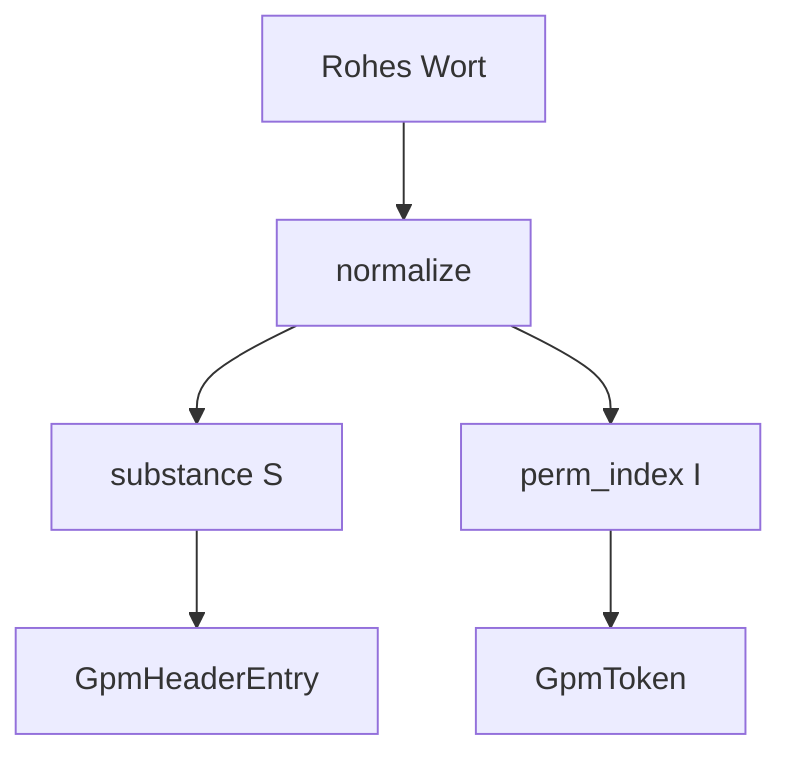

# NL kompilieren & rekonstruieren

Natürlichsprache (Prosa) wird Wort für Wort tokenisiert. Modul: `analysis/compile/`.



## Kern-API

| Funktion | Parameter | Rückgabe | Beschreibung |
|----------|-----------|----------|--------------|
| `compile_text` | `text`, `profile`, optional `version` | `(GpmDocument, CompileStats)` | Vollständige Kompilierung |
| `compile_text_to_gpm` | `text`, `profile`, optional `version` | `(doc, bytes, stats)` | + Binär-Output |
| `reconstruct_text` | `GpmDocument` | `str` | Verlustfreie Rekonstruktion |
| `tokenize_nl` | `text` | Wort/Gap-Segmente | Rohe Segmentierung |

## Ablauf intern

1. **Segmentierung** — Wörter und Inter-Word-Gaps (`analysis/compile/tokenize.py`)
2. **Normalisierung** — pro `AlphabetProfile` (`prepare_substrate`, Profile-Regeln)
3. **Header** — jedes distinct Wort: canonical, normalized, substance S
4. **Body** — pro Token: `word_id`, `perm_index` I, `case_code`
5. **Explicit** — Wörter, deren Schreibweise nicht aus case_code rekonstruierbar ist



## Gap-Symmetrie

Siehe [datenmodell.md](datenmodell.md): `n` Wörter → `n+1` Gaps. Satzzeichen und Leerzeichen liegen in Gaps, nicht als eigene Wörter.

**Beispiel** `"Hello, world!"`:

| Index | Inhalt |
|-------|--------|
| gap[0] | `""` |
| token[0] | `Hello` |
| gap[1] | `", "` |
| token[1] | `world` |
| gap[2] | `"!"` |

## Case-Policy

Groß/Klein wird als `case_code` gespeichert oder über `explicit` abgebildet. Details: [case-policy.md](case-policy.md).

## Beispiel — Round-Trip

```python
from alphabets import AlphabetProfile
from analysis.compile.compiler import compile_text, compile_text_to_gpm
from analysis.compile.reconstruct import reconstruct_text
from analysis.binary.format import read_gpm, VERSION

source = "Erster Satz.\nZweiter Satz."
doc, stats = compile_text(source, AlphabetProfile.OG)
assert reconstruct_text(doc) == source

doc2, blob, _ = compile_text_to_gpm(source, AlphabetProfile.OG, version=VERSION)
loaded = read_gpm(blob)
assert reconstruct_text(loaded) == source
```

## Beispiel — Explizite Schreibweise

Wörter mit Sonderfall-Großschreibung landen in `explicit`:

```python
doc, _ = compile_text("iPhone", AlphabetProfile.OG)
# doc.explicit kann (0, "iPhone") enthalten wenn case_code nicht reicht
```

## Grenzen

- Ziffern-only-Wörter können übersprungen werden (Profil-abhängig).
- NL-Pfad kennt **keine** Code-Keywords — `if` in Prosa ist Wort (S), nicht C.
- Mehrzeilige Gaps sind erlaubt (`\n\n` für Absätze).

## Siehe auch

- [datenmodell.md](datenmodell.md)
- [case-policy.md](case-policy.md)
- [binary-format.md](binary-format.md)
- [tutorials/erstes-gpm-dokument.md](../tutorials/erstes-gpm-dokument.md)
- Tests: `tests/analysis/test_compile.py`, `test_case.py`
