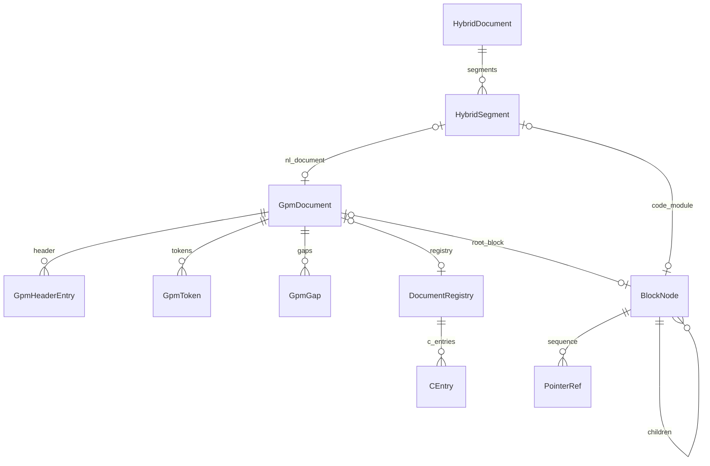
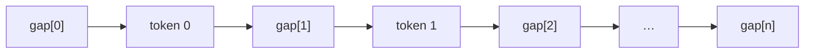

# Datenmodell

Zentrale In-Memory-Typen der Analyse-Schicht. Modul: `analysis/document/`, `analysis/blocks/`, `analysis/code/hybrid.py`.



## GpmDocument

| Feld | Typ | Bedeutung |
|------|-----|-----------|
| `profile` | `AlphabetProfile` | Schriftprofil für alle Wörter |
| `header` | `list[GpmHeaderEntry]` | Wörterbuch: canonical, normalized, substance |
| `tokens` | `list[GpmToken]` | Body: Verweis auf header + perm_index + case |
| `gaps` | `list[str]` | Formatierung **zwischen** Tokens (inkl. vor/nach) |
| `explicit` | `list[tuple[int,str]]` | Ausnahme-Schreibweise pro Token-Index |
| `registry` | `DocumentRegistry \| None` | Code-/Geometrie-C-Einträge (v9) |
| `root_block` | `BlockNode \| None` | NL-Fraktalbaum oder Code-Modul |
| `cells` | `list[CellGeometry]` | Zell-Partition nach `materialize_geometry` |
| `hierarchy` | `DocumentHierarchy \| None` | Satz/Absatz/Linie/Seite |
| `gap_rle` | `dict[int,str] \| None` | Abweichungen von Standard-Gaps (v9) |

### GpmHeaderEntry

| Feld | Bedeutung |
|------|-----------|
| `word_id` | Index in `header` |
| `word_canonical` | Original-Schreibweise (Anzeige) |
| `word_normalized` | Normalisiert für Perm-Raum |
| `substance` | Primzahlprodukt S |
| `perm_index` | Header-eigener I (selten genutzt) |

### GpmToken

| Feld | Bedeutung |
|------|-----------|
| `word_id` | Verweis auf `header[word_id]` |
| `perm_index` | I im Perm-Raum des normalisierten Worts |
| `case_code` | Groß/Klein-Kodierung |
| `payload_kind` | `S`, `N`, … |

## Gap-Symmetrie

**Invariante:** Bei `n` Tokens gibt es **genau `n + 1` Gaps**.



Rekonstruktion: `gap[0] + word[0] + gap[1] + … + gap[n]`.

```python
from analysis.document.invariants import assert_gap_symmetry

assert_gap_symmetry(doc)  # wirft bei Verletzung
```

## BlockNode & PointerRef

Code und NL-Geometrie nutzen einen **Baum** aus `BlockNode`:

| Feld | Bedeutung |
|------|-----------|
| `block_id` | Eindeutige ID |
| `level` | `MODULE`, `CODE_BLOCK`, `PARAGRAPH`, `SENTENCE`, `CELL`, … |
| `sequence` | Geordnete `PointerRef`-Liste |
| `children` | Verschachtelte Blöcke |
| `meta` | z. B. `visual_style`, `trailing_whitespace` |

`PointerRef` verweist auf Registry-Einträge:

| Feld | Bedeutung |
|------|-----------|
| `kind` | `S`, `N`, `C`, `SYS`, … |
| `ptr_id` | Index in Registry-Tabelle |
| `nl`, `col_prefix` | Formatierung vor dem Literal (Code) |
| `meta` | z. B. `open_syntax`, `close_syntax` |

## DocumentRegistry

Internes Wörterbuch für **Literale** (Code-Symbole, Zahlen, Geometrie-Keys):

- `s_entries`, `n_entries`, `c_entries`, …
- C-Einträge aus Code (`COrigin.CODE`) vs. Geometrie (`COrigin.GEOM`) unterscheidbar

## HybridDocument

| Feld | Bedeutung |
|------|-----------|
| `profile` | NL-Profil für Prosa-Segmente |
| `segments` | Liste `HybridSegment` in Quell-Reihenfolge |
| `registry` | Gemeinsame Code-Registry |
| `source_trailing` | Whitespace am Dateiende |

`HybridSegment`: `domain` (NL/CODE), `nl_document` oder `code_module`, `fence_open`/`fence_close`.

## Funktionen

| Funktion | Modul | Rückgabe | Invariante |
|----------|-------|----------|------------|
| `assert_gap_symmetry` | `document.invariants` | — | len(gaps) == len(tokens)+1 |
| `GpmDocument(...)` | `document.model` | Instanz | — |
| `DocumentRegistry.intern` | `blocks.registry` | ptr_id | Kein Whitespace in Literals |
| `BlockNode(...)` | `blocks.node` | Instanz | — |

## Beispiel

```python
from alphabets import AlphabetProfile
from analysis.compile.compiler import compile_text
from analysis.compile.reconstruct import reconstruct_text
from analysis.document.invariants import assert_gap_symmetry

doc, _ = compile_text("Hallo Welt.", AlphabetProfile.OG)
assert_gap_symmetry(doc)
assert len(doc.gaps) == len(doc.tokens) + 1
assert reconstruct_text(doc) == "Hallo Welt."
```

## Grenzen

- Gaps dürfen nur Formatierungszeichen enthalten (Space, Tab, Newline) — keine Wort-Inhalte.
- Code-Whitespace liegt in `nl`/`col_prefix`, nicht in S-Registry-Einträgen.
- `root_block` aus Code und NL-Fraktalbaum sind unterschiedliche Semantik — nicht verwechseln.

## Siehe auch

- [compile.md](compile.md) — wie `GpmDocument` entsteht
- [binary-format.md](binary-format.md) — Serialisierung
- [geometrie.md](geometrie.md) — `materialize_geometry`
- [code/index.md](code/index.md) — `BlockNode` für Quellcode
- Tests: `tests/analysis/test_compile.py`
