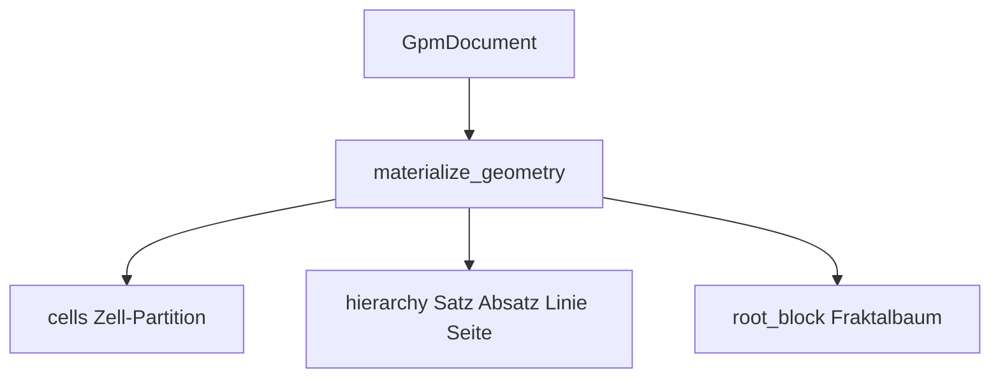
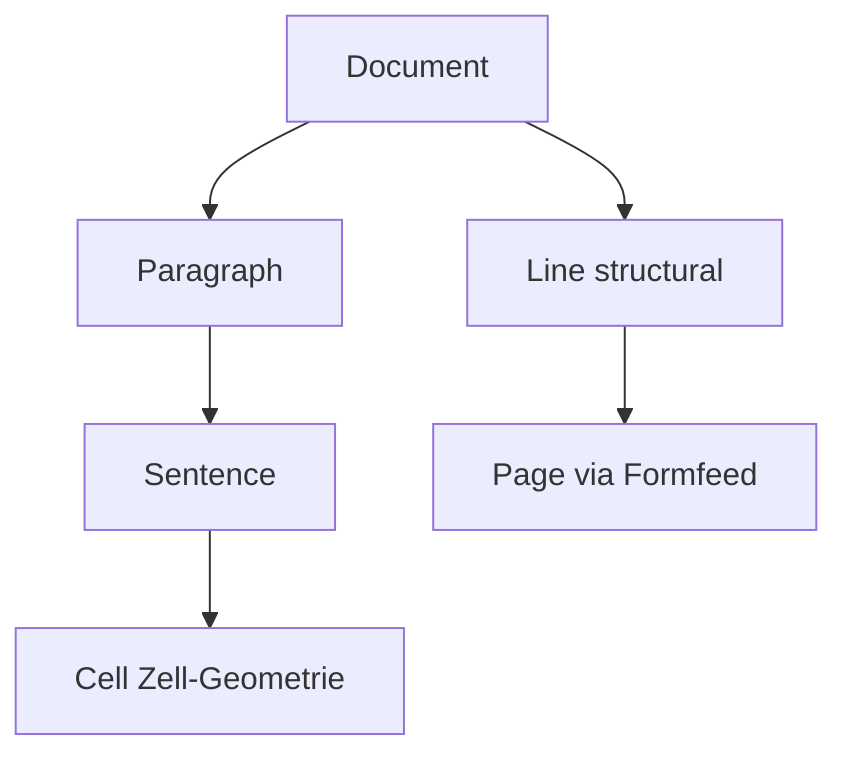
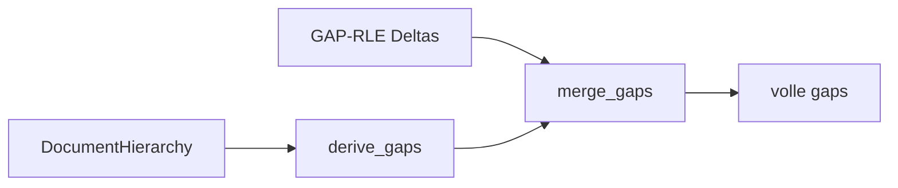

# Geometrie & Hierarchie

Fraktale Struktur über kompilierten NL-Texten. Module: `analysis/hierarchy/`, `analysis/cell/`, `analysis/blocks/build.py`, `analysis/reconstruct/`.



## Zwei Layer

| Layer | Ebenen | Modul |
|-------|--------|-------|
| **Semantisch** | Phrase → Satz → Absatz | `hierarchy/geom.py` |
| **Strukturell** | Linie → Seite | `hierarchy/geom.py` |



## Kern-Funktionen

| Funktion | Modul | Beschreibung |
|----------|-------|--------------|
| `build_document_hierarchy` | `hierarchy.geom` | `DocumentHierarchy` aus Gaps |
| `build_document_cells` | `cell.geom` | Zell-Partition, Perm-Overflow-Split |
| `build_block_tree` | `blocks.build` | NL-Fraktalbaum in `root_block` |
| `materialize_geometry` | `blocks.build` | cells + hierarchy + tree (falls fehlend) |
| `split_page_spans` | `hierarchy.geom` | Seiten an `\f` (Formfeed) |
| `derive_gaps` | `reconstruct.derive_gaps` | Gaps aus Hierarchie ableiten |
| `merge_gaps` | `reconstruct.derive_gaps` | RLE mit abgeleiteten Gaps vereinen |
| `ensure_lossless_gaps` | `reconstruct.derive_gaps` | Gap-Map für v9-Schreiben |

## Zell-Geometrie

Jede **Zelle** ist eine Permutations-Einheit über Kategorie-Keys der enthaltenen Tokens:

- `frequencies`, `category_sequence`, `perm_index`, `perm_space`
- Bei zu großem Perm-Raum: `split_for_perm_overflow`

## Page-Spans

Druckseiten-Umbrüche (`\f` in Gaps) erzeugen **Page**-Knoten — exportiert für PDF/Druck, nicht für Standard-Rekonstruktion.

## Beispiel

```python
from alphabets import AlphabetProfile
from analysis.compile.compiler import compile_text
from analysis.blocks.build import materialize_geometry

doc, _ = compile_text("Zeile eins.\fZeile zwei.", AlphabetProfile.OG)
materialize_geometry(doc)

assert doc.cells
assert doc.hierarchy
assert doc.root_block
pages = doc.hierarchy.structural.pages
# pages kann bei \f mehr als einen Eintrag haben
```

## Gap-Ableitung



Ermöglicht kompakte `.gpm`-Speicherung bei erhaltener bitgenauer Rekonstruktion.

## Grenzen

- Hierarchie-Grenzen folgen Gap-Heuristiken (Satzzeichen, `\n\n`, Zeilenumbruch).
- Code-`BlockNode`-Bäume sind unabhängig vom NL-Fraktalbaum.
- Page-Spans nur bei `\f` im Text.

## Siehe auch

- [datenmodell.md](datenmodell.md)
- [binary-format.md](binary-format.md)
- [vergleich.md](vergleich.md) — Zell-Kurven
- Tests: `tests/analysis/test_hierarchy.py`, `test_cell_geom.py`, `test_v9_binary.py`
