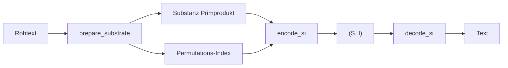

# S(I) — Substanz & Index

Kern-Kodierung aller Profile. Modul: `gpm_types/si/`.



## Substanz S

**Kommutativ** — Anagramme haben gleiches S.

| Funktion | Beschreibung |
|----------|--------------|
| `S(seq, profile)` | Kurzform Substanz |
| `substance_for_profile(seq, profile)` | Primprodukt |
| `ingredients_for_profile(S, profile)` | Multimenge aus S |
| `substance_og_alpha` / `substance_roman` | Profil-spezifisch |

## Index I

**Ordungssensitiv** — Anagramme haben verschiedenes I.

| Funktion | Beschreibung |
|----------|--------------|
| `encode_si(raw, profile)` | → `(substance, index)` |
| `decode_si(S, I, profile)` | → Text |
| `encode` / `decode` | Nur `AlphabetProfile.OG` (Legacy) |
| `perm_index_for_profile` | I aus Sequenz |
| `perm_space` / `perm_space_of` | N = \|Perm-Raum\| |

## Sequenz-Identitäten

| API | Bedeutung |
|-----|-----------|
| `Sk(seq)` | Rohes Zeichen-Tuple |
| `Sk_lut(seq, profile)` | Tuple via LUT |
| `Sp(seq, profile)` | Positions-Substanz |
| `Lut(seq, profile)` | Materialisierte LUT |
| `sequence_key_via_lut` | Sk + Sp Kaskade |

## Beispiel

```python
from alphabets import AlphabetProfile
from gpm_types.si.codec import encode_si, decode_si

S, I = encode_si("HALLO", AlphabetProfile.OG)
assert decode_si(S, I, AlphabetProfile.OG) == "HALLO"

S2, I2 = encode_si("OLLAH", AlphabetProfile.OG)
assert S2 == S and I2 != I  # Anagramm
```

## Siehe auch

- [../../grundfunktionen/README.md](../../grundfunktionen/README.md)
- [perm.md](../perm.md)
- [../vergleich.md](../vergleich.md)
- Tests: `tests/parity/test_si.py`, `tests/alphabets/test_perm_identity_all_profiles.py`
