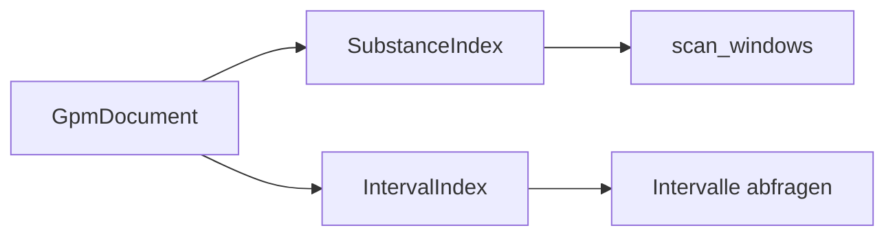

# Index-Paket — Suche im Dokument

Fenster- und Intervall-Indizes über kompilierte Dokumente. Modul: `analysis/index/`.



## SubstanceIndex

| Methode | Beschreibung |
|---------|--------------|
| `build` / Konstruktor | Index aus Dokument |
| `scan_windows` | Gleitende Fenster nach Substanz-Muster |
| Fingerprint | Substanz-Signatur pro Fenster |

Nutzen: Vorbereitung für Spectroscope-ähnliche Suche (OG-Feature — siehe [og/roadmap.md](../og/roadmap.md)).

## IntervalIndex

| Methode | Beschreibung |
|---------|--------------|
| Hierarchie-Intervalle | Token-Spans für Satz/Absatz/Linie |
| Query | Überlappung, Enclosure |

## Beispiel

```python
from alphabets import AlphabetProfile
from analysis.compile.compiler import compile_text
from analysis.index.substance_index import SubstanceIndex

doc, _ = compile_text("Langer Text mit vielen Wörtern.", AlphabetProfile.OG)
idx = SubstanceIndex(doc)
# hits = idx.scan_windows(window_size=3, ...)
```

## Grenzen

- Kein Volltext-Regex — arithmetische/geom. Suche
- OG `search_by_gcd` / `search_by_lcm` noch nicht portiert

## Siehe auch

- [geometrie.md](geometrie.md)
- [og/roadmap.md](../og/roadmap.md)
- Tests: `tests/analysis/test_hierarchy.py` (IntervalIndex)
