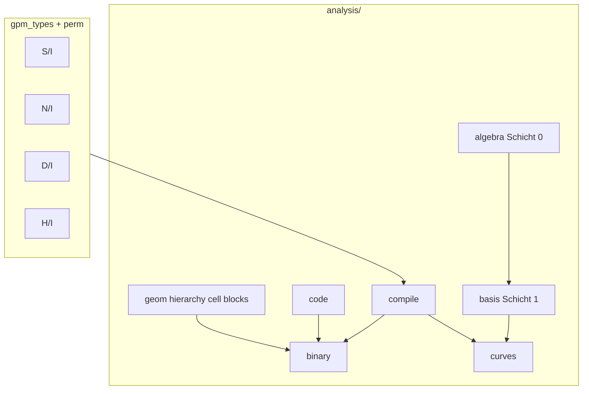

# API-Referenz — Index

Alphabetisch gruppiert nach Paket. **Detailseiten** enthalten Diagramme, Beispiele und Grenzen.

## Top-Level (`analysis`)

Direkt importierbar aus `from analysis import …`:

| Funktion | Modul | Kurz | Detail |
|----------|-------|------|--------|
| `compile_text` | `analysis.compile.compiler` | NL → `GpmDocument` | [compile.md](compile.md) |
| `compile_text_to_gpm` | `analysis.compile.compiler` | NL → `(doc, bytes, stats)` | [compile.md](compile.md) |
| `reconstruct_text` | `analysis.compile.reconstruct` | `GpmDocument` → Quelltext | [compile.md](compile.md) |
| `write_gpm` | `analysis.binary.format` | `GpmDocument` → bytes | [binary-format.md](binary-format.md) |
| `read_gpm` | `analysis.binary.format` | bytes → `GpmDocument` | [binary-format.md](binary-format.md) |
| `load_gpm` | `analysis.binary.reader` | Pfad → `GpmDocument` | [binary-format.md](binary-format.md) |
| `analyze_gpm` | `analysis.binary.reader` | Metadaten + Kurz-Analyse | [binary-format.md](binary-format.md) |
| `read_gpm_any` | `analysis.binary.compat` | v4/v7/v8/v9 lesen | [binary-format.md](binary-format.md) |

## Kompilieren & Rekonstruktion

| Funktion | Modul | Kurz | Detail |
|----------|-------|------|--------|
| `compile_text` | `analysis.compile.compiler` | Wort-Token + Gaps | [compile.md](compile.md) |
| `compile_text_to_gpm` | `analysis.compile.compiler` | inkl. Binär-Output | [compile.md](compile.md) |
| `reconstruct_text` | `analysis.compile.reconstruct` | Gap-Symmetrie 1:1 | [compile.md](compile.md) |
| `tokenize_nl` | `analysis.compile.tokenize` | Rohe NL-Segmentierung | [compile.md](compile.md) |
| `derive_gaps` | `analysis.reconstruct.derive_gaps` | Gaps aus Hierarchie | [geometrie.md](geometrie.md) |
| `merge_gaps` | `analysis.reconstruct.derive_gaps` | RLE + abgeleitete Gaps | [geometrie.md](geometrie.md) |
| `ensure_lossless_gaps` | `analysis.reconstruct.derive_gaps` | Verlustfreie Gap-Map | [geometrie.md](geometrie.md) |

## Code & Hybrid

| Funktion | Modul | Kurz | Detail |
|----------|-------|------|--------|
| `compile_source` | `analysis.code.compile` | Code → `BlockNode` | [code/index.md](code/index.md) |
| `reconstruct_source` | `analysis.code.decompile` | Block → Quelltext | [code/index.md](code/index.md) |
| `verify_reversibility` | `analysis.code.compile` | Round-Trip-Check | [code/tokenizer.md](code/tokenizer.md) |
| `compile_hybrid` | `analysis.code.compile` | Markdown-Fences | [code/compile-hybrid.md](code/compile-hybrid.md) |
| `compile_hybrid_to_gpm` | `analysis.code.compile` | Hybrid → v9 bytes | [code/compile-hybrid.md](code/compile-hybrid.md) |
| `reconstruct_hybrid` | `analysis.code.decompile` | Hybrid → Markdown | [code/compile-hybrid.md](code/compile-hybrid.md) |
| `verify_hybrid_reversibility` | `analysis.code.compile` | Hybrid Round-Trip | [code/compile-hybrid.md](code/compile-hybrid.md) |
| `tokenize_source` | `analysis.code.tokenizer` | Lexer-Einstieg | [code/tokenizer.md](code/tokenizer.md) |
| `canonicalize_for_analysis` | `analysis.code.canonicalize` | Toy-ähnlich (optional) | [code/compile-hybrid.md](code/compile-hybrid.md) |
| `language_for_id` | `analysis.code.languages` | `LanguageSpec` | [code/tokenizer.md](code/tokenizer.md) |
| `resolve_fence_language` | `analysis.code.languages` | Fence-Alias → id | [code/compile-hybrid.md](code/compile-hybrid.md) |

## Geometrie & Blöcke

| Funktion | Modul | Kurz | Detail |
|----------|-------|------|--------|
| `materialize_geometry` | `analysis.blocks.build` | Zellen + Hierarchie + Baum | [geometrie.md](geometrie.md) |
| `build_block_tree` | `analysis.blocks.build` | NL-Fraktalbaum | [geometrie.md](geometrie.md) |
| `build_document_hierarchy` | `analysis.hierarchy.geom` | Satz/Absatz/Linie/Seite | [geometrie.md](geometrie.md) |
| `build_document_cells` | `analysis.cell.geom` | Zell-Partition | [geometrie.md](geometrie.md) |
| `encode_block_tree` | `analysis.blocks.codec` | BlockNode → bytes | [binary-format.md](binary-format.md) |
| `decode_block_tree` | `analysis.blocks.codec` | bytes → BlockNode | [binary-format.md](binary-format.md) |
| `assert_gap_symmetry` | `analysis.document.invariants` | n Token → n+1 Gaps | [datenmodell.md](datenmodell.md) |

## Vergleich & Kurven

| Funktion | Modul | Kurz | Detail |
|----------|-------|------|--------|
| `analyze_pair` | `analysis.curves.compare` | 4-Achsen-Fusion | [vergleich.md](vergleich.md) |
| `compare_word_pair_analysis` | `analysis.curves.compare` | Wortpaar-Kurven | [vergleich.md](vergleich.md) |
| `analyze_word_pair` | `analysis.pair.analyze_word_pair` | Ein Paar encodieren | [vergleich.md](vergleich.md) |
| `extract_substance_curve` | `analysis.curves.substance_curve` | Substanz pro Token | [vergleich.md](vergleich.md) |
| `extract_i_curve` | `analysis.curves.i_curve` | I-Ratio-Kette | [vergleich.md](vergleich.md) |
| `compare_substance_sequences` | `analysis.align.substance_align` | DTW auf Substanz | [vergleich.md](vergleich.md) |
| `compare_substance_curves` | `analysis.align.substance_align` | Dokument-Kurven-DTW | [vergleich.md](vergleich.md) |
| `substance_ggt_kgv_distance` | `analysis.substance.compare` | Abstand zweier S | [vergleich.md](vergleich.md) |
| → kanonisch | `analysis.algebra.substance_kernel` | gleiche API (Phase F-1) | [analysis/algebra-layer.md](../analysis/algebra-layer.md) |
| `compare_substances` | `analysis.algebra.substance_kernel` | Feld-Dict ggT/kgV/ratio | [vergleich.md](vergleich.md) |
| `log_jaccard_basis_blend` | `analysis.algebra.fusion` | Tier-1 Blend Log+Jaccard | [analysis/algebra-layer.md](../analysis/algebra-layer.md) |
| `exponent_window_to_substance` | `analysis.algebra.window_fold` | Fenster-LCM-Metadaten (F-A) | [analysis/algebra-layer.md](../analysis/algebra-layer.md) |
| `compare_documents_tiered` | `analysis.basis.compare_tiered` | Gestaffelter Paar-Vergleich | [analysis/basis-layer.md](../analysis/basis-layer.md) |
| `build_basis_index` | `analysis.basis.index` | Korpus-Basis-Index | [analysis/basis-layer.md](../analysis/basis-layer.md) |
| `query_candidates` | `analysis.basis.index` | Kandidaten-Vorfilter | [analysis/basis-layer.md](../analysis/basis-layer.md) |
| `find_similar_documents` | `analysis.basis.corpus_compare` | Korpus-Ähnlichkeitssuche | [analysis/basis-layer.md](../analysis/basis-layer.md) |
| `classify_word_pair` | `analysis.substance.diff` | Teilmenge/Anagramm/… | [vergleich.md](vergleich.md) |
| `dtw_similarity` | `analysis.geom.dtw` | DTW-Kern | [vergleich.md](vergleich.md) |

## Case & Index

| Funktion | Modul | Kurz | Detail |
|----------|-------|------|--------|
| `detect_case` | `analysis.case.detect` | Case-Code pro Wort | [case-policy.md](case-policy.md) |
| `apply_case` | `analysis.case.apply` | Case aus Code anwenden | [case-policy.md](case-policy.md) |
| `SubstanceIndex` | `analysis.index.substance_index` | Fenster-Fingerabdruck | [index-package.md](index-package.md) |
| `IntervalIndex` | `analysis.index.interval_index` | Hierarchie-Intervalle | [index-package.md](index-package.md) |

## S/I-Kern (`gpm_types` + `perm`)

| Funktion | Modul | Kurz | Detail |
|----------|-------|------|--------|
| `encode_si` | `gpm_types.si.codec` | Text → (S, I) | [gpm_types/si.md](gpm_types/si.md) |
| `decode_si` | `gpm_types.si.codec` | (S, I) → Text | [gpm_types/si.md](gpm_types/si.md) |
| `S` / `substance_for_profile` | `gpm_types.si.substance` | Substanz berechnen | [gpm_types/si.md](gpm_types/si.md) |
| `Sk`, `Sp`, `Sk_lut`, `Lut` | `gpm_types.si.order` | Sequenz-Identitäten | [gpm_types/si.md](gpm_types/si.md) |
| `encode_ni` / `decode_ni` | `gpm_types.ni.codec` | N(I) | [gpm_types/ni.md](gpm_types/ni.md) |
| `encode_di` / `decode_di` | `gpm_types.di.codec` | D(I) | [gpm_types/di.md](gpm_types/di.md) |
| `parse_hi_segments` | `gpm_types.hi.segments` | H(I) Segmente | [gpm_types/hi.md](gpm_types/hi.md) |
| `perm_index` | `perm.multiset` | I aus Multimenge | [perm.md](perm.md) |
| `perm_space` | `perm.multiset` | N = \|Perm-Raum\| | [perm.md](perm.md) |

## Tools

| Funktion | Modul | Kurz | Detail |
|----------|-------|------|--------|
| `perm_audit` (CLI) | `tools.perm_audit` | Invarianten aller Profile | [tools.md](tools.md) |
| `profile_benchmark` (CLI) | `tools.profile_benchmark` | Grenz-Sweep | [tools.md](tools.md) |

## Paket-Übersicht

## Siehe auch

- [Algebra-Layer](../analysis/algebra-layer.md)
- [Basis-Layer](../analysis/basis-layer.md)
- [Analyse-Navigation](../analyse/index.md)
- [Tests](tests.md)
- [OG-Modulkarte](../og/modul-karte.md)
