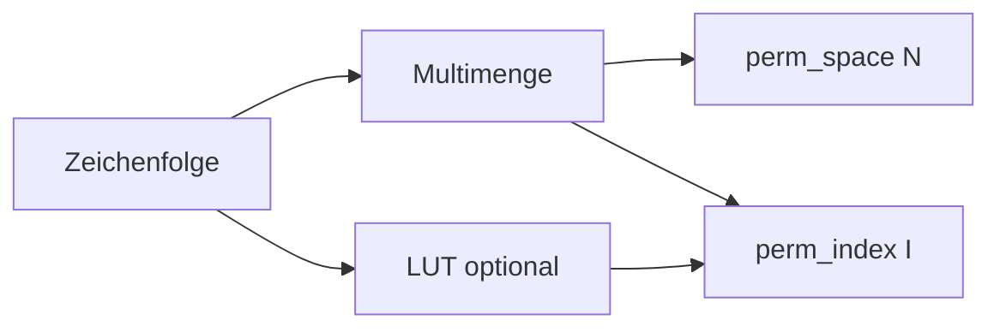

# Permutation & LUT

Permutations-Index und Lookup-Tables. Modul: `perm/`.



## Kern-Funktionen

| Funktion | Modul | Beschreibung |
|----------|-------|--------------|
| `perm_space(counts)` | `perm.multiset` | Anzahl Permutationen N |
| `perm_index(seq, counts)` | `perm.multiset` | Rang I (1-basiert) |
| `perm_decode(counts, I, lex_order)` | `perm.multiset` | Sequenz aus I |
| `perm_fits_width(n, width)` | `perm.multiset` | Width-Gate für Benchmark |
| `permutation_lut_for_sequence` | `gpm_types.si.order` | LUT bauen |

## Width-Gate

Wenn N_perm zu groß für 16-Byte-Register → Benchmark/Encode bricht kontrolliert ab. Siehe [../../benchmark/README.md](../../benchmark/README.md).

## Beispiel

```python
from collections import Counter
from perm.multiset import perm_space, perm_index

counts = Counter({"A": 2, "B": 1, "C": 1})
n = perm_space(counts)
i = perm_index("AABC", counts)
assert 1 <= i <= n
```

## Siehe auch

- [gpm_types/si.md](gpm_types/si.md)
- [../../benchmark/README.md](../../benchmark/README.md)
- Tests: `tests/test_permutation.py`, `tests/test_perm_lut.py`
