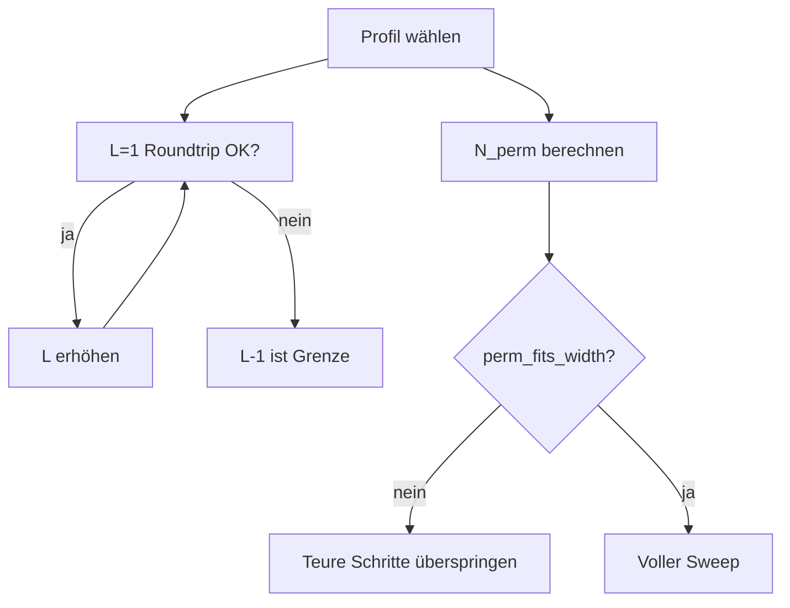

# Tools

CLI-Werkzeuge unter `GPM/functions/tools/`.

| Tool | Befehl | Beschreibung |
|------|--------|--------------|
| **perm_audit** | `python -m tools.perm_audit` | Perm-Invarianten aller 33 Profile |
| **profile_benchmark** | `python -m tools.profile_benchmark` | Grenz-Sweep L/N/I (~54 s) |
| **benchmark_report** | (intern) | Markdown aus JSON |
| **benchmark_patterns** | (intern) | Test-String-Generatoren |

## perm_audit

Prüft für jedes Profil:

- Anagramm-Regel (gleiches S, verschiedenes I)
- LUT-Konsistenz
- Encode/Decode-Roundtrip

## profile_benchmark

Misst pro Profil:

- Maximale Wortlänge L mit Roundtrip
- Perm-Raum N und Width-Gate
- LUT-Build-Grenze (L ≤ 12)

Output: [../benchmark/PROFILE_LIMITS.md](../benchmark/PROFILE_LIMITS.md), `benchmark_results.json`.

## Siehe auch

- [../benchmark/README.md](../benchmark/README.md)
- [perm.md](perm.md)
- Tests: `tests/benchmark/test_profile_limits_smoke.py`
