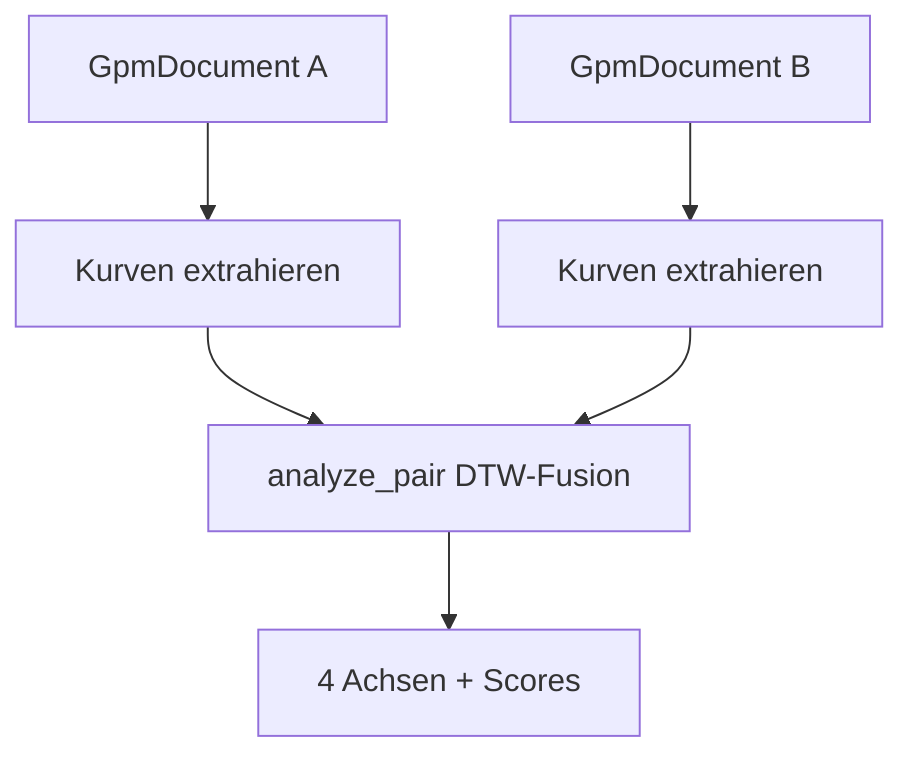
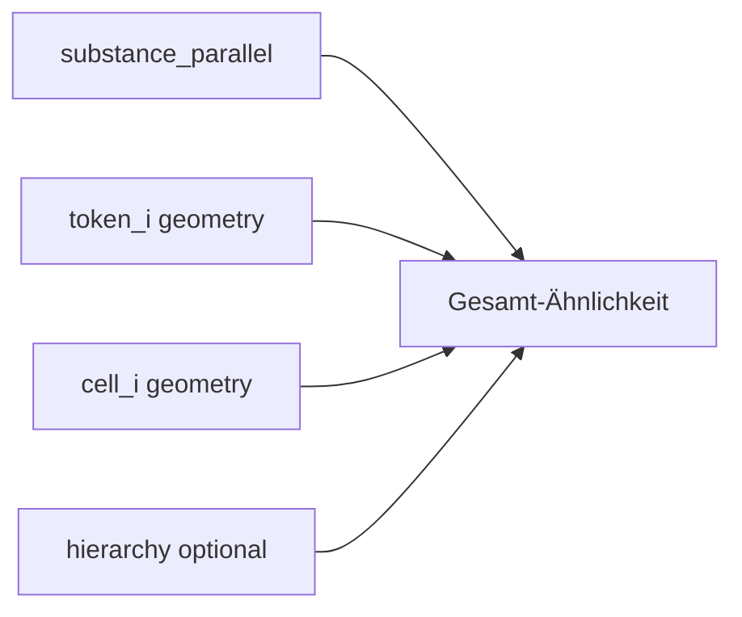

# Vergleich & Kurven

Ähnlichkeit ohne rohen String-Vergleich. Module: `analysis/curves/`, `analysis/substance/`, `analysis/geom/dtw.py`, `analysis/pair/`.



## Vier Achsen (`analyze_pair`)

| Achse | Quelle | LISTEN vs SILENT |
|-------|--------|------------------|
| **substance** | Substanz-Kette, ggT/kgV | ≈ parallel (Anagramm) |
| **token_i** | I-Ratio pro Token | divergiert |
| **cell_i** | Satz-Zell-Geometrie | variabel |
| **hierarchy** | Satz-/Absatz-Struktur | optional |



## Substanz-Mathematik

| Funktion | Modul | Beschreibung |
|----------|-------|--------------|
| `substance_ggt_kgv_similarity` | `substance.compare` | Ähnlichkeit via ggT/kgV |
| `substance_ggt_kgv_distance` | `substance.compare` | DTW-Distanz auf S-Werten |
| `compare_substances` | `substance.compare` | Feld-Dict ggT/kgV/ratio |
| `classify_word_pair` | `substance.diff` | Teilmenge, Anagramm, Disjoint |
| `transition_fields` | `substance.transition` | ggT/kgV zwischen aufeinanderfolgenden S |

> **Legacy-Hinweis:** `substance.compare` und `substance.transition` re-exportieren aus dem kanonischen Kernel. Neue Imports: `analysis.algebra.substance_kernel` (Phase F-1).

**ggT** = gemeinsame Primfaktoren; **kgV** = minimale Oberhülle beider Substanz-Mengen.

### Kanonisch (Phase F) — `substance_kernel`

| Funktion | Modul | Beschreibung |
|----------|-------|--------------|
| `compare_substances` | `algebra.substance_kernel` | Feld-Dict ggT/kgV/ratio |
| `substance_ggt_kgv_similarity` | `algebra.substance_kernel` | Ähnlichkeit via ggT/kgV |
| `substance_ggt_kgv_distance` | `algebra.substance_kernel` | Abstand zweier S |
| `substance_transition_fields` | `algebra.substance_kernel` | Übergänge zwischen S-Werten |
| `empty_transition_fields` | `algebra.substance_kernel` | Leere Transition (Anfang/Ende) |
| `substance_covers` | `algebra.substance_kernel` | kgV-Abdeckungs-Gate |
| `coupled_point_similarity` | `algebra.substance_kernel` | I×S-Kopplung (Härtungs-Inv. D-B) |

Detail: [analysis/algebra-layer.md](../analysis/algebra-layer.md).

## Tiered Compare (Basis-Layer)

Gestaffelter Dokument-Vergleich ohne sofortigen Voll-DTW. Module: `analysis/basis/`.

| Funktion | Modul | Beschreibung |
|----------|-------|--------------|
| `compare_documents_tiered` | `basis.compare_tiered` | Paar-Vergleich Tier 0–4 |
| `build_basis_signature` | `basis.signature` | Log-Profil + Jaccard-Signatur |
| `build_basis_index` | `basis.index` | Invertierter Index für Korpus |
| `query_candidates` | `basis.index` | Postings + MinHash-Vorfilter |
| `find_similar_documents` | `basis.corpus_compare` | Zwei-Stufen-Korpus-Suche |
| `CompareTier` | `basis.compare_tiered` | Enum Tier 0–4 |

Detail: [analysis/basis-layer.md](../analysis/basis-layer.md).

## Gewichts-Fusion (Phase F-B)

Alle Blend-Gewichte zentral in `analysis/algebra/fusion.py`:

| Funktion | Beschreibung |
|----------|--------------|
| `log_jaccard_basis_blend` | Tier-1: Log ggT/kgV + Jaccard |
| `fuse_structure_tier` | Tier-2: Meta + Relations + Bitmask |
| `fuse_curve_tier` | Tier-3: i_curve + substance |
| `fuse_profile_overlay` | Profil-Overlay auf Basis-Score |
| `fuse_isomorphism_index` | Voll-Isomorphie-Index |
| `fuse_cell_i_similarity` | Zell-I-Ähnlichkeit |
| `WEIGHTS_*` | Kanonische Gewichts-Konstanten |

Detail: [analysis/algebra-layer.md](../analysis/algebra-layer.md).

## Kurven-Extraktion

| Funktion | Modul | Liefert |
|----------|-------|---------|
| `extract_substance_curve` | `curves.substance_curve` | S pro Token + Übergänge |
| `extract_i_curve` | `curves.i_curve` | I-Ratio, Delta-Ratio |
| `extract_cell_curve` | `cell.curves` | Zell-Ebene |
| `extract_phrase_curve` / `extract_sentence_curve` | `hierarchy.curves` | Hierarchie-Ebenen |

## DTW & Alignment

| Funktion | Modul | Beschreibung |
|----------|-------|--------------|
| `dtw_similarity` | `geom.dtw` | Dynamische Zeit-Warping-Ähnlichkeit |
| `compare_substance_sequences` | `align.substance_align` | DTW auf Substanz-Listen |
| `compare_substance_curves` | `align.substance_align` | DTW auf Dokument-Kurven |

## Wortpaar-Analyse

| Funktion | Modul | Beschreibung |
|----------|-------|--------------|
| `analyze_word_pair` | `pair.analyze_word_pair` | Zwei Wörter → S/I + Klassifikation |
| `compare_word_pair_analysis` | `curves.compare` | Kurven-Vergleich für Wortpaare |

## Beispiel — LISTEN / SILENT

```python
from alphabets import AlphabetProfile
from analysis.compile.compiler import compile_text
from analysis.curves.compare import analyze_pair

d1, _ = compile_text("LISTEN", AlphabetProfile.OG)
d2, _ = compile_text("SILENT", AlphabetProfile.OG)
result = analyze_pair(d1, d2)

assert result["substance_parallel"]  # gleiche Buchstaben
# token_i-Achse deutlich unter 1.0 — andere Permutation
```

## Beispiel — Wortpaar

```python
from analysis.pair.analyze_word_pair import analyze_word_pair
from alphabets import AlphabetProfile

info = analyze_word_pair("HALLO", "OLLAH", AlphabetProfile.OG)
# info enthält substance, classification, …
```

## Grenzen

- `analyze_pair` ersetzt nicht OG Meta-Genom / Struktur-Kreuzvalidierung (siehe [og/roadmap.md](../og/roadmap.md)).
- DTW bei sehr unterschiedlicher Länge kann `failed` setzen.
- Kurven-Vergleich setzt kompilierte Dokumente voraus — nicht auf Rohstrings.

## Siehe auch

- [analysis/algebra-layer.md](../analysis/algebra-layer.md)
- [analysis/basis-layer.md](../analysis/basis-layer.md)
- [compile.md](compile.md)
- [geometrie.md](geometrie.md)
- [gpm_types/si.md](gpm_types/si.md)
- [tutorials/listen-vs-silent.md](../tutorials/listen-vs-silent.md)
- Tests: `tests/analysis/test_curves_fusion.py`, `test_substance_compare.py`, `test_word_pair.py`
- Blocker D–F: [tests.md](tests.md#algebra--basis--blocker-tests-phase-df)
