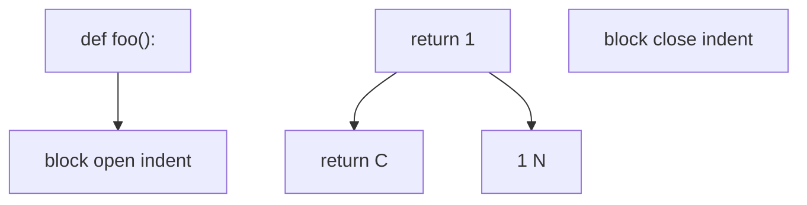

# Tutorial: Code bitgenau

Python-Quelltext kompilieren und rekonstruieren — inkl. Einrückung.

## Ausgangstext

```python
def foo():
    return 1

```

## Schritt 1 — Kompilieren

```python
from alphabets import AlphabetProfile
from analysis.blocks.registry import DocumentRegistry
from analysis.code.compile import compile_source, verify_reversibility
from analysis.code.decompile import reconstruct_source

src = "def foo():\n    return 1\n"
reg = DocumentRegistry(profile=AlphabetProfile.OG)
mod = compile_source(src, "py", reg)
```

## Schritt 2 — Rekonstruieren

```python
out = reconstruct_source(mod, reg)
assert out == src
assert verify_reversibility(src, "py", reg)
```

## Was passiert intern?



Jedes Token trägt:

| Feld | Bedeutung |
|------|-----------|
| `nl` | Newlines davor |
| `col_prefix` | Spaces/Tabs auf der Zeile |

Die **4 Spaces** vor `return` liegen in `col_prefix` — nicht in der Registry.

## JavaScript-Beispiel

```python
js = "arr[i]\n"
assert verify_reversibility(js, "js", reg)
# [ und ] = bracket visual_style, kein Block
```

## Weiter

- [../referenz/code/tokenizer.md](../referenz/code/tokenizer.md)
- [../referenz/code/index.md](../referenz/code/index.md)
- [hybrid-markdown.md](hybrid-markdown.md)
