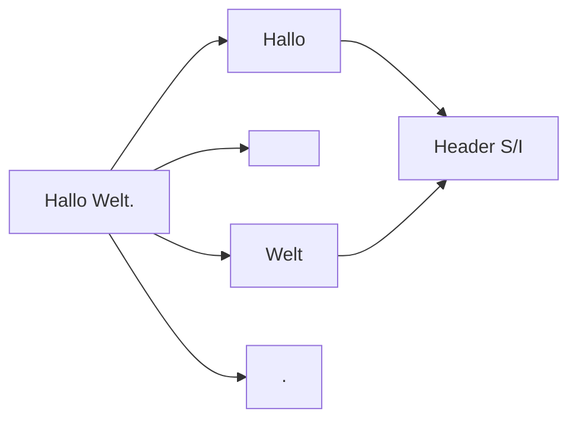

# Tutorial: Erstes .gpm-Dokument

Schritt für Schritt von Rohtext zu `.gpm` und zurück.

## Ausgangstext

```
Hallo Welt.
```

## Schritt 1 — Kompilieren

```python
from alphabets import AlphabetProfile
from analysis.compile.compiler import compile_text

text = "Hallo Welt."
doc, stats = compile_text(text, AlphabetProfile.OG)

print(len(doc.header), "Wörter im Header")
print(len(doc.tokens), "Tokens im Body")
print(len(doc.gaps), "Gaps")  # = len(tokens) + 1
```

**Intern:**



## Schritt 2 — Rekonstruieren

```python
from analysis.compile.reconstruct import reconstruct_text

assert reconstruct_text(doc) == text
```

## Schritt 3 — Als .gpm speichern

```python
from analysis.binary.format import write_gpm, read_gpm, VERSION

blob = write_gpm(doc, version=VERSION)
assert blob[:3] == b"GPM"
assert blob[3] == VERSION

loaded = read_gpm(blob)
assert reconstruct_text(loaded) == text
```

## Schritt 4 — Optional Geometrie

```python
from analysis.blocks.build import materialize_geometry

materialize_geometry(loaded)
assert loaded.cells
assert loaded.hierarchy
```

## Erwartetes Ergebnis

- Bitgenauer Round-Trip
- v9-Datei mit Profil + optional Hierarchie

## Weiter

- [../referenz/compile.md](../referenz/compile.md)
- [../referenz/binary-format.md](../referenz/binary-format.md)
- [listen-vs-silent.md](listen-vs-silent.md)
