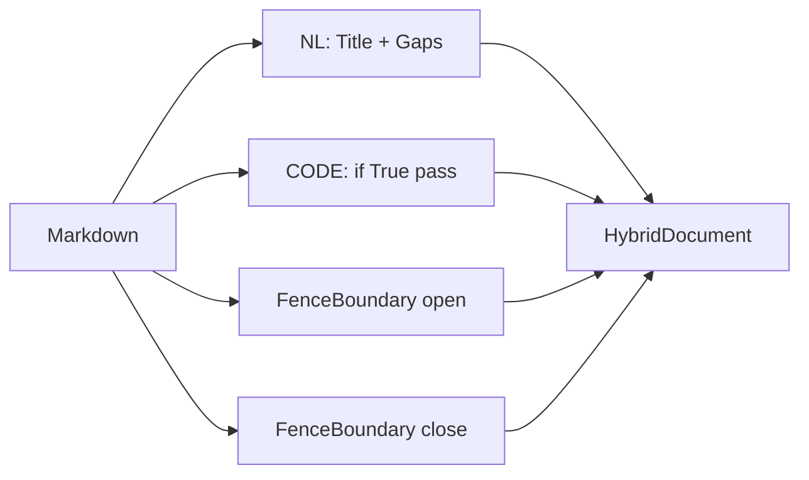

# Tutorial: Hybrid-Markdown

Prosa und Code in einer Datei — bitgenau.

## Ausgangstext

```markdown
Title

```py
if True:
    pass
```

```

(Achtung: Leerzeile vor der Fence ist Teil der Invariante.)

## Schritt 1 — Kompilieren

```python
from alphabets import AlphabetProfile
from analysis.code.compile import compile_hybrid, verify_hybrid_reversibility
from analysis.code.decompile import reconstruct_hybrid

src = "Title\n\n```py\nif True: pass\n```\n"
doc = compile_hybrid(src, AlphabetProfile.OG)
```

## Schritt 2 — Round-Trip

```python
assert reconstruct_hybrid(doc) == src
assert verify_hybrid_reversibility(src)
```

## Intern: Segmente



**Gap-Erhaltungs-Invariante:** Die Leerzeile `\n\n` vor `` ``` `` bleibt an der Fence-Grenze — nicht im `nl` des ersten Code-Tokens.

## Schritt 3 — v9 exportieren

```python
from analysis.code.compile import compile_hybrid_to_gpm

_, blob = compile_hybrid_to_gpm(src)
# Enthält NL-Body + Code Block-Tree
```

## Weiter

- [../referenz/code/compile-hybrid.md](../referenz/code/compile-hybrid.md)
- Tests: `test_code_hybrid_gaps.py`
