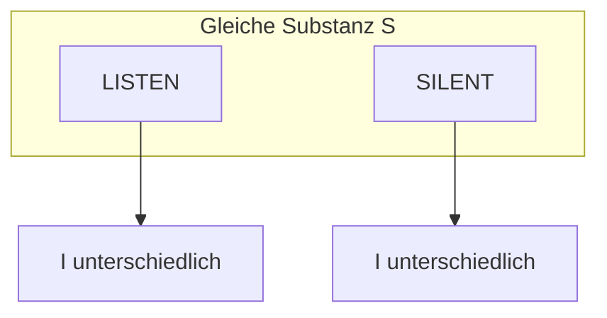

# Tutorial: LISTEN vs SILENT

Warum gleiche Buchstaben **nicht** gleicher Text sind — und wie GPM das misst.

## Ausgang

Zwei Anagramme:

- `LISTEN`
- `SILENT`

## Schritt 1 — Kompilieren

```python
from alphabets import AlphabetProfile
from analysis.compile.compiler import compile_text
from gpm_types.si.codec import encode_si

for word in ("LISTEN", "SILENT"):
    S, I = encode_si(word, AlphabetProfile.OG)
    print(word, "S=", S, "I=", I)
```

**Beobachtung:** Gleiches **S**, verschiedenes **I**.



## Schritt 2 — Dokument-Vergleich

```python
from analysis.curves.compare import analyze_pair

d1, _ = compile_text("LISTEN", AlphabetProfile.OG)
d2, _ = compile_text("SILENT", AlphabetProfile.OG)
result = analyze_pair(d1, d2)

print(result["substance_parallel"])  # True
# token_i / cell_i Achsen < 1.0
```

## Was passiert intern?

| Achse | LISTEN vs SILENT |
|-------|------------------|
| substance | parallel — gleiche Primfaktoren |
| token_i | niedrig — Permutation anders |
| cell_i | abhängig von Satzkontext |
| hierarchy | bei Ein-Wort-Docs trivial |

## Erwartetes Ergebnis

`analyze_pair` erkennt **Buchstaben-Identität** ohne **Reihenfolge-Identität** — genau die GPM-Idee.

## Weiter

- [../referenz/vergleich.md](../referenz/vergleich.md)
- [../grundfunktionen/README.md](../grundfunktionen/README.md)
